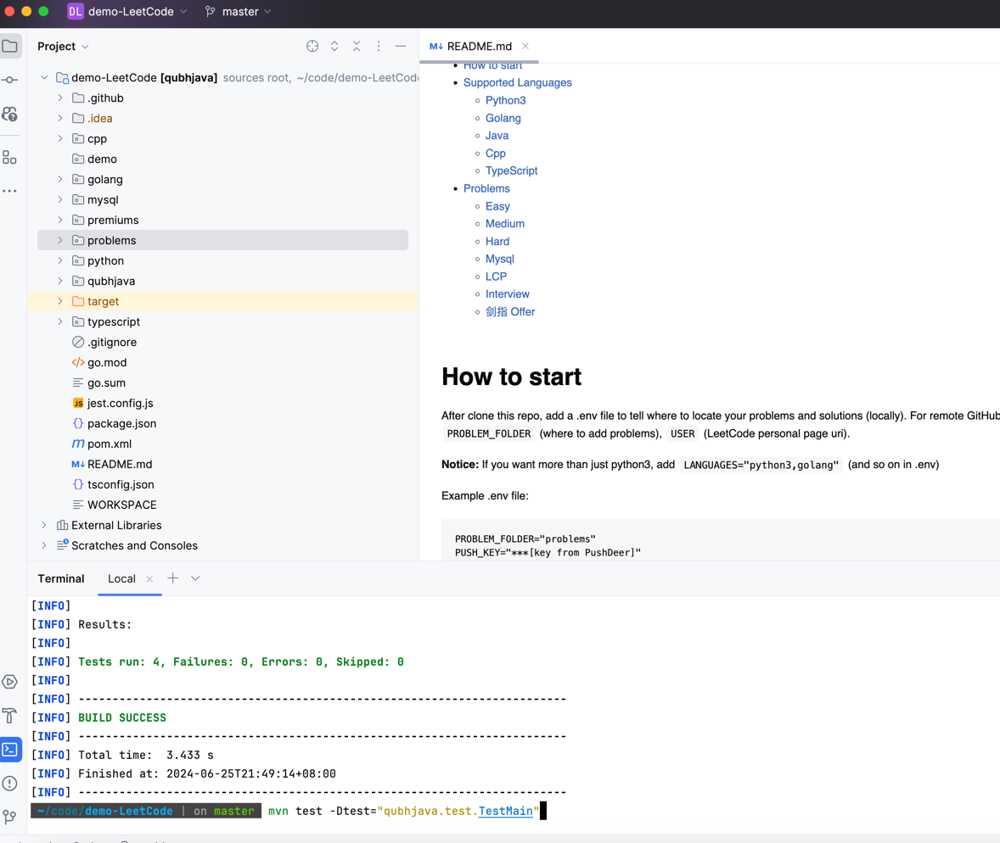
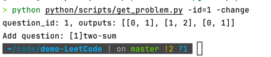
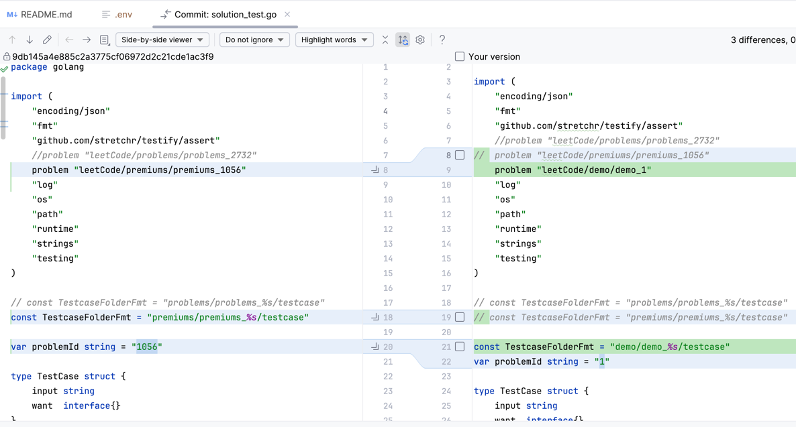
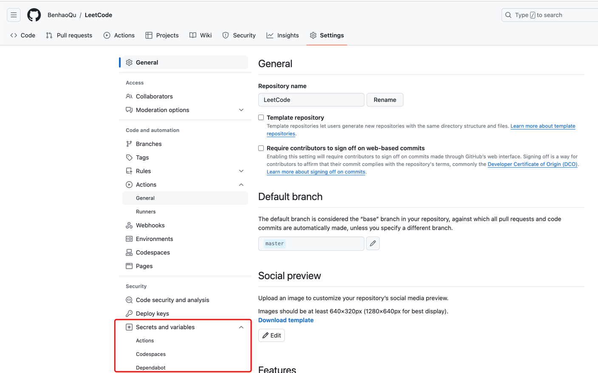
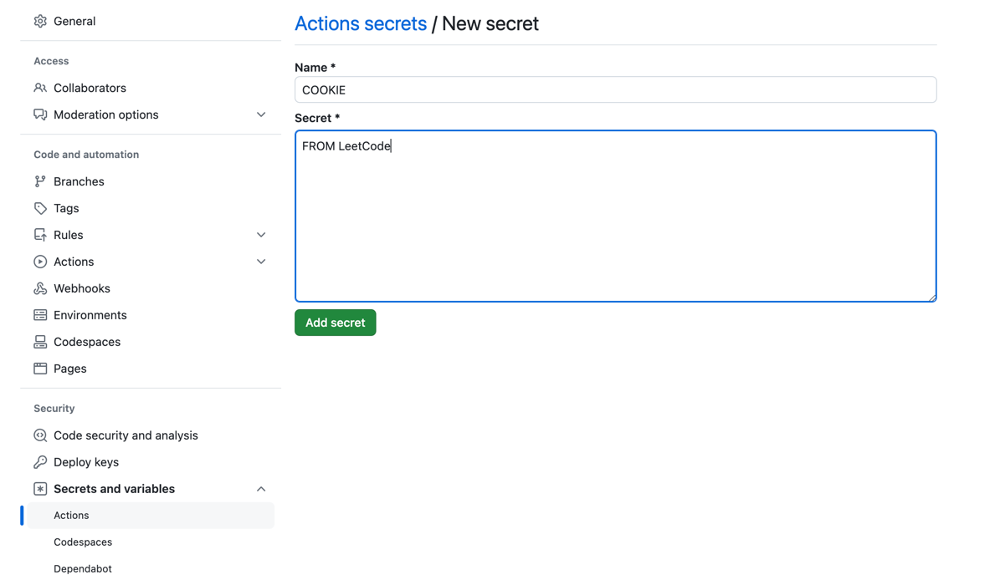

# LeetCode

Algorithms in LeetCode by Benhao

# Table of Content

- [How to start](#how-to-start)
- [Supported Languages](#supported-languages)
    * [Python3](#python3)
    * [Golang](#golang)
    * [Java](#java)
    * [Cpp](#cpp)
    * [TypeScript](#typescript)
- [Demo](#Demo)
    * [Local](#Local)
    * [GitHub](#GitHub)
    * [Demo Projects](#Demo-Projects)
- [Problems](#problems)
    * [Easy](#easy)
    * [Medium](#medium)
    * [Hard](#hard)
    * [Mysql](#mysql)
    * [LCP](#lcp)
    * [Interview](#interview)
    * [剑指 Offer](#剑指-offer)

# How to start

After clone this repo, add a .env file to tell where to locate your problems and solutions (locally).
For remote GitHub Action, add `COOKIE` (LeetCode cookie), `PUSH_KEY` (PushDeer notification), `PROBLEM_FOLDER` (where to
add problems), `USER` (LeetCode personal page uri).

**Notice:** If you want more than just python3, add `LANGUAGES="python3,golang"` (and so on in .env)

Example .env file:

```text
PROBLEM_FOLDER="problems"
PUSH_KEY="***[key from PushDeer]"
COOKIE="***[cookie from LeetCode graphql]"
LANGUAGES="python3,golang,java,cpp,typescript"
USER="himymben"
```

install python3.12 requirements:

```shell
pip install -r python/requirements.txt
```

To directly submit Solution to LeetCode, try any language below:

```shell
python python/scripts/submit.py -h
# usage: submit.py [-h] [-id ID] {go,py,ts,js,c++,java,golang,python3,typescript,javascript,cpp}
python python/scripts/submit.py python3 -id=1
python python/scripts/submit.py -id=2 py
python python/scripts/submit.py py
python python/scripts/submit.py golang -id=2
python python/scripts/submit.py cpp -id=1
python python/scripts/submit.py java -id=2
python python/scripts/submit.py typescript -id=1
```

To get any problem you want, try:

```shell
python python/scripts/get_problem.py -h
# usage: get_problem.py [-h] [-id PROBLEM_ID] [-slug PROBLEM_SLUG] [-cate PROBLEM_CATEGORY] [-f] [-all] [-pm] [-debug DEBUG_FILE] [-change] [-sl]
python python/scripts/get_problem.py -id=1
```

To generate daily problems, try:

```shell
python python/scripts/daily_auto.py
```

To fetch daily submits from LeetCode (requires `.env` COOKIE or USER to be ready), try:

```shell
python python/scripts/daily_submission.py
```

# Supported Languages

## Python3

Check [Python3 README](python/README.md)

## Golang

Check [Golang README](golang/README.md)

## Java

Check [Java README](qubhjava/README.md)

## Cpp

Check [Cpp README](cpp/README.md)

## Typescript

Check [TypeScript README](typescript/README.md)

# Demo

Fork the repo of your own


Clone your own forked repo

**Notice: create your own branch and set it as repo default, and keep master!**

## Local

Open the code project and installed languages environments as needed.

Test your environment by running languages test, for instance:

if you are facing errors here, contact the author.

Find a cookie from LeetCode (monthly update)


Create your own .env file (Notice: better to use a problem folder other than exists as the author is using them, there
will be a lot of conflicts):

```
PROBLEM_FOLDER=demo
COOKIE="***[cookie from LeetCode graphql]"
LANGUAGES="golang,java"
```

Create the folder 'demo' based on your own .env

Run scripts to fetch problems, run tests and submit your solution.

If you get problem like this, 

it will add the problem and change the tests of your languages as below:



In VsCode,
add launch.json under `.vscode`
```json5
{
    // Use IntelliSense to learn about possible attributes.
    // Hover to view descriptions of existing attributes.
    // For more information, visit: https://go.microsoft.com/fwlink/?linkid=830387
    "version": "0.2.0",
    "configurations": [
        {
            "name": "Typescript Test",
            "type": "node",
            "request": "launch",
            "preLaunchTask": "typescript-test",
        },
        {
            "name": "Typescript Tests",
            "type": "node",
            "request": "launch",
            "preLaunchTask": "typescript-tests",
        },
        {
            "name": "Python Test",
            "type": "node",
            "request": "launch",
            "preLaunchTask": "python-test",
        },
        {
            "name": "Python Tests",
            "type": "node",
            "request": "launch",
            "preLaunchTask": "python-tests",
        },
        {
            "name": "Golang Test",
            "type": "node",
            "request": "launch",
            "preLaunchTask": "golang-test",
        },
        {
            "name": "Golang Tests",
            "type": "node",
            "request": "launch",
            "preLaunchTask": "golang-tests",
        },
        {
            "name": "C++ Test",
            "type": "node",
            "request": "launch",
            "preLaunchTask": "cpp-test",
        },
        {
            "name": "C++ Tests",
            "type": "node",
            "request": "launch",
            "preLaunchTask": "cpp-tests",
        },
        {
            "name": "Java Test",
            "type": "node",
            "request": "launch",
            "preLaunchTask": "java-test",
        },
        {
            "name": "Java Tests",
            "type": "node",
            "request": "launch",
            "preLaunchTask": "java-tests",
        }
    ]
}
```
and tasks.json under `.vscode`
```json5
{
	"version": "2.0.0",
	"tasks": [
		{
			"label": "typescript-test",
			"command": "npm",
			"args": ["test", "--alwaysStric", "--strictBindCallApply", "--strictFunctionTypes", "--target", "ES2022", "typescript/test.ts"],
			"type": "shell"
		},
		{
			"label": "typescript-tests",
			"command": "npm",
			"args": ["test", "--alwaysStric", "--strictBindCallApply", "--strictFunctionTypes", "--target", "ES2022", "typescript/problems.test.ts"],
			"type": "shell"
		},
		{
			"label": "python-test",
			"command": "python",
			"args": ["python/test.py"],
			"type": "shell"
		},
		{
			"label": "python-tests",
			"command": "python",
			"args": ["python/tests.py"],
			"type": "shell"
		},
		{
			"label": "golang-test",
			"command": "go",
			"args": ["test", "golang/solution_test.go", "golang/test_basic.go", "-test.timeout", "3s"],
			"type": "shell"
		},
		{
			"label": "golang-tests",
			"command": "go",
			"args": ["test", "golang/problems_test.go", "golang/test_basic.go", "-test.timeout", "10s"],
			"type": "shell"
		},
		{
			"label": "cpp-test",
			"command": "bazel",
			"args": ["test", "--cxxopt=-std=c++20", "--test_timeout=3", "--test_output=all", "//cpp:solution_test"],
			"type": "shell"
		},
		{
			"label": "cpp-tests",
			"command": "bazel",
			"args": ["test", "--cxxopt=-std=c++20", "--test_timeout=10", "--test_output=all", "//cpp/tests:all"],
			"type": "shell"
		},
		{
			"label": "java-test",
			"command": "mvn",
			"args": ["test", "-Dtest=\"qubhjava.test.TestMain\""],
			"type": "shell"
		},
		{
			"label": "java-tests",
			"command": "mvn",
			"args": ["test", "-Dtest=\"qubhjava.test.ProblemsTest\""],
			"type": "shell"
		}
	]
}
```

If you want to write c++ in idea better, load this `CMakeLists.txt`. But still, run test in bazel.
```cmake
cmake_minimum_required(VERSION 3.28)
project(LeetCodeCpp)

set(CMAKE_CXX_STANDARD 20)

include(FetchContent)
# googletest
FetchContent_Declare(
        googletest
        GIT_REPOSITORY https://github.com/google/googletest.git
        GIT_TAG release-1.10.0 # Specify the version you need
)
FetchContent_MakeAvailable(googletest)

# nlohmann_json
FetchContent_Declare(
        json
        GIT_REPOSITORY https://github.com/nlohmann/json.git
        GIT_TAG v3.9.1 # Specify the version you need
)
FetchContent_MakeAvailable(json)

include_directories(LeetCode)

file(GLOB_RECURSE COMMON_SOURCE LeetCode/cpp/*.cpp LeetCode/cpp/*.h)
file(GLOB_RECURSE PROBLEM_SOLUTIONS LeetCode/problems/*.cpp)
file(GLOB_RECURSE PREMIUMS_SOLUTIONS LeetCode/premiums/*.cpp)

add_executable(LeetCodeCpp
        ${COMMON_SOURCE}
        ${PROBLEM_SOLUTIONS}
        ${PREMIUMS_SOLUTIONS}
)

target_link_libraries(LeetCodeCpp
        gtest_main
        gmock_main
        nlohmann_json::nlohmann_json
)
```

Solve your problem and enjoy!

Feel free to ask the author and add issues, discussions on GitHub.

## GitHub

Config [GitHub Action Secrets](https://docs.github.com/en/authentication/keeping-your-account-and-data-secure/managing-your-personal-access-tokens#creating-a-personal-access-token-classic) for daily auto scripts. {SECRETS: TOKEN}


Add values similar to you .env, for example, 


**Notice:** 
Add PROBLEM_FOLDER for [actions](.github/workflows/) to work properly.

## Demo Projects
1. [Benhao Demo](https://github.com/BenhaoQu/LeetCode/tree/demo_master) (Python3)
2. [SilentSliver Demo](https://github.com/SilentSliver/LeetCode/) (Java)
3. [LazyKindMan Demo](https://github.com/lazyKindMan/LeetCode) (Golang)


# Problems

## Easy

[1480.Running Sum of 1d Array](problems/problems_1480/problem.md)

[1431.Kids With the Greatest Number of Candies](problems/problems_1431/problem.md)

[1470.Shuffle the Array](problems/problems_1470/problem.md)

[1512.Number of Good Pairs](problems/problems_1512/problem.md)

[1108.Defanging an IP Address](problems/problems_1108/problem.md)

[771.Jewels and Stones](problems/problems_771/problem.md)

[665.Non-decreasing Array](problems/problems_665/problem.md)

[1342.Number of Steps to Reduce a Number to Zero](problems/problems_1342/problem.md)

[1528.Shuffle String](problems/problems_1528/problem.md)

[1365.How Many Numbers Are Smaller Than the Current Number](problems/problems_1365/problem.md)

[1281.Subtract the Product and Sum of Digits of an Integer](problems/problems_1281/problem.md)

[1603.Design Parking System](problems/problems_1603/problem.md)

[1313.Decompress Run-Length Encoded List](problems/problems_1313/problem.md)

[1614.Maximum Nesting Depth of the Parentheses](problems/problems_1614/problem.md)

[1389.Create Target Array in the Given Order](problems/problems_1389/problem.md)

[1486.XOR Operation in an Array](problems/problems_1486/problem.md)

[1221.Split a String in Balanced Strings](problems/problems_1221/problem.md)

[1662.Check If Two String Arrays are Equivalent](problems/problems_1662/problem.md)

[66.Plus One](problems/problems_66/problem.md)

[1672.Richest Customer Wealth](problems/problems_1672/problem.md)

[938.Range Sum of BST](problems/problems_938/problem.md)

[1290.Convert Binary Number in a Linked List to Integer](problems/problems_1290/problem.md)

[1588.Sum of All Odd Length Subarrays](problems/problems_1588/problem.md)

[1656.Design an Ordered Stream](problems/problems_1656/problem.md)

[104.Maximum Depth of Binary Tree Solution](problems/problems_104/problem.md)

[83.Remove Duplicates from Sorted List](problems/problems_83/problem.md)

[897.Increasing Order Search Tree](problems/problems_897/problem.md)

[605.Can Place Flowers](problems/problems_605/problem.md)

[1678.Goal Parser Interpretation](problems/problems_1678/problem.md)

[941.Valid Mountain Array](problems/problems_941/problem.md)

[944.Delete Columns to Make Sorted](problems/problems_944/problem.md)

[812.Largest Triangle Area](problems/problems_812/problem.md)

[26.Remove Duplicates from Sorted Array](problems/problems_26/problem.md)

[190.Reverse Bits](problems/problems_190/problem.md)

[1.Two Sum](problems/problems_1/problem.md)

[1684.Count the Number of Consistent Strings](problems/problems_1684/problem.md)

[1688.Count of Matches in Tournament](problems/problems_1688/problem.md)

[53.Maximum Subarray](problems/problems_53/problem.md)

[977.Squares of a Sorted Array](problems/problems_977/problem.md)

[136.Single Number](problems/problems_136/problem.md)

[1694.Reformat Phone Number](problems/problems_1694/problem.md)

[908.Smallest Range I](problems/problems_908/problem.md)

[141.Linked List Cycle](problems/problems_141/problem.md)

[110.Balanced Binary Tree](problems/problems_110/problem.md)

[1030.Matrix Cells in Distance Order](problems/problems_1030/problem.md)

[496.Next Greater Element I](problems/problems_496/problem.md)

[1700.Number of Students Unable to Eat Lunch](problems/problems_1700/problem.md)

[1704.Determine if String Halves Are Alike](problems/problems_1704/problem.md)

[121.Best Time to Buy and Sell Stock](problems/problems_121/problem.md)

[122.Best Time to Buy and Sell Stock II](problems/problems_122/problem.md)

[733.Flood Fill](problems/problems_733/problem.md)

[1640.Check Array Formation Through Concatenation](problems/problems_1640/problem.md)

[1710.Maximum Units on a Truck](problems/problems_1710/problem.md)

[21.Merge Two Sorted Lists](problems/problems_21/problem.md)

[830.Positions of Large Groups](problems/problems_830/problem.md)

[1539.Kth Missing Positive Number](problems/problems_1539/problem.md)

[1716.Calculate Money in Leetcode Bank](problems/problems_1716/problem.md)

[1720.Decode XORed Array](problems/problems_1720/problem.md)

[88.Merge Sorted Array](problems/problems_88/problem.md)

[1646.Get Maximum in Generated Array](problems/problems_1646/problem.md)

[1725.Number Of Rectangles That Can Form The Largest Square](problems/problems_1725/problem.md)

[20.Valid Parentheses](problems/problems_20/problem.md)

[1732.Find the Highest Altitude](problems/problems_1732/problem.md)

[1736.Latest Time by Replacing Hidden Digits](problems/problems_1736/problem.md)

[23.Merge k Sorted Lists](problems/problems_23/problem.md)

[1437.Check If All 1's Are at Least Length K Places Away](problems/problems_1437/problem.md)

[1742.Maximum Number of Balls in a Box](problems/problems_1742/problem.md)

[191.Number of 1 Bits](problems/problems_191/problem.md)

[594.Longest Harmonious Subsequence](problems/problems_594/problem.md)

[1748.Sum of Unique Elements](problems/problems_1748/problem.md)

[1752.Check if Array Is Sorted and Rotated](problems/problems_1752/problem.md)

[821.Shortest Distance to a Character](problems/problems_821/problem.md)

[242.Valid Anagram](problems/problems_242/problem.md)

[1758.Minimum Changes To Make Alternating Binary String](problems/problems_1758/problem.md)

[1337.The K Weakest Rows in a Matrix](problems/problems_1337/problem.md)

[13.Roman to Integer](problems/problems_13/problem.md)

[1763.Longest Nice Substring](problems/problems_1763/problem.md)

[1768.Merge Strings Alternately](problems/problems_1768/problem.md)

[1773.Count Items Matching a Rule](problems/problems_1773/problem.md)

[303.Range Sum Query - Immutable](problems/problems_303/problem.md)

[232.Implement Queue using Stacks](problems/problems_232/problem.md)

[1779.Find Nearest Point That Has the Same X or Y Coordinate](problems/problems_1779/problem.md)

[1784.Check if Binary String Has at Most One Segment of Ones](problems/problems_1784/problem.md)

[706.Design HashMap](problems/problems_706/problem.md)

[1047.Remove All Adjacent Duplicates In String](problems/problems_1047/problem.md)

[224.Basic Calculator](problems/problems_224/problem.md)

[705.Design HashSet](problems/problems_705/problem.md)

[1790.Check if One String Swap Can Make Strings Equal](problems/problems_1790/problem.md)

[1796.Second Largest Digit in a String](problems/problems_1796/problem.md)

[1800.Maximum Ascending Subarray Sum](problems/problems_1800/problem.md)

[1805.Number of Different Integers in a String](problems/problems_1805/problem.md)

[1812.Determine Color of a Chessboard Square](problems/problems_1812/problem.md)

[1816.Truncate Sentence](problems/problems_1816/problem.md)

[263.Ugly Number](problems/problems_263/problem.md)

[1822.Sign of the Product of an Array](problems/problems_1822/problem.md)

[783.Minimum Distance Between BST Nodes](problems/problems_783/problem.md)

[530.Minimum Absolute Difference in BST](problems/problems_530/problem.md)

[1827.Minimum Operations to Make the Array Increasing](problems/problems_1827/problem.md)

[1832.Check if the Sentence Is Pangram](problems/problems_1832/problem.md)

[27.Remove Element](problems/problems_27/problem.md)

[28.Implement strStr()](problems/problems_28/problem.md)

[204.Count Primes](problems/problems_204/problem.md)

[1837.Sum of Digits in Base K](problems/problems_1837/problem.md)

[690.Employee Importance](problems/problems_690/problem.md)

[1844.Replace All Digits with Characters](problems/problems_1844/problem.md)

[1848.Minimum Distance to the Target Element](problems/problems_1848/problem.md)

[7.Reverse Integer](problems/problems_7/problem.md)

[1854.Maximum Population Year](problems/problems_1854/problem.md)

[872.Leaf-Similar Trees](problems/problems_872/problem.md)

[1859.Sorting the Sentence](problems/problems_1859/problem.md)

[1863.Sum of All Subset XOR Totals](problems/problems_1863/problem.md)

[993.Cousins in Binary Tree](problems/problems_993/problem.md)

[1869.Longer Contiguous Segments of Ones than Zeros](problems/problems_1869/problem.md)

[1668.Maximum Repeating Substring](problems/problems_1668/problem.md)

[461.Hamming Distance](problems/problems_461/problem.md)

[1876.Substrings of Size Three with Distinct Characters](problems/problems_1876/problem.md)

[231.Power of Two](problems/problems_231/problem.md)

[1880.Check if Word Equals Summation of Two Words](problems/problems_1880/problem.md)

[342.Power of Four](problems/problems_342/problem.md)

[1652.Defuse the Bomb](problems/problems_1652/problem.md)

[160.Intersection of Two Linked Lists](problems/problems_160/problem.md)

[203.Remove Linked List Elements](problems/problems_203/problem.md)

[1886.Determine Whether Matrix Can Be Obtained By Rotation](problems/problems_1886/problem.md)

[1893.Check if All the Integers in a Range Are Covered](problems/problems_1893/problem.md)

[1897.Redistribute Characters to Make All Strings Equal](problems/problems_1897/problem.md)

[278.First Bad Version](problems/problems_278/problem.md)

[374.Guess Number Higher or Lower](problems/problems_374/problem.md)

[852.Peak Index in a Mountain Array](problems/problems_852/problem.md)

[1903.Largest Odd Number in String](problems/problems_1903/problem.md)

[401.Binary Watch](problems/problems_401/problem.md)

[1909.Remove One Element to Make the Array Strictly Increasing](problems/problems_1909/problem.md)

[1913.Maximum Product Difference Between Two Pairs](problems/problems_1913/problem.md)

[168.Excel Sheet Column Title](problems/problems_168/problem.md)

[645.Set Mismatch](problems/problems_645/problem.md)

[1920.Build Array from Permutation](problems/problems_1920/problem.md)

[225.Implement Stack using Queues](problems/problems_225/problem.md)

[1925.Count Square Sum Triples](problems/problems_1925/problem.md)

[1929.Concatenation of Array](problems/problems_1929/problem.md)

[155.Min Stack](problems/problems_155/problem.md)

[1935.Maximum Number of Words You Can Type](problems/problems_1935/problem.md)

[1941.Check if All Characters Have Equal Number of Occurrences](problems/problems_1941/problem.md)

[1945.Sum of Digits of String After Convert](problems/problems_1945/problem.md)

[671.Second Minimum Node In a Binary Tree](problems/problems_671/problem.md)

[171.Excel Sheet Column Number](problems/problems_171/problem.md)

[1952.Three Divisors](problems/problems_1952/problem.md)

[1957.Delete Characters to Make Fancy String](problems/problems_1957/problem.md)

[1137.N-th Tribonacci Number](problems/problems_1137/problem.md)

[1961.Check If String Is a Prefix of Array](problems/problems_1961/problem.md)

[1967.Number of Strings That Appear as Substrings in Word](problems/problems_1967/problem.md)

[551.Student Attendance Record I](problems/problems_551/problems.md)

[345.Reverse Vowels of a String](problems/problems_345/problem.md)

[541.Reverse String II](problems/problems_541/problem.md)

## Medium

[2.Add Two Numbers](problems/problems_2/problem.md)

[1476.Subrectangle Queries](problems/problems_1476/problem.md)

[646.Maximum Length of Pair Chain](problems/problems_646/problem.md)

[822.Card Flipping Game](problems/problems_822/problem.md)

[165.Compare Version Numbers](problems/problems_165/problem.md)

[382.Linked List Random Node](problems/problems_382/problem.md)

[1492.The kth Factor of n](problems/problems_1492/problem.md)

[1680.Concatenation of Consecutive Binary Numbers](problems/problems_1680/problem.md)

[1679.Max Number of K-Sum Pairs](problems/problems_1679/problem.md)

[117.Populating Next Right Pointers in Each Node II](problems/problems_117/problem.md)

[59.Spiral Matrix II](problems/problems_59/problem.md)

[1010.Pairs of Songs With Total Durations Divisible by 60](problems/problems_1010/problem.md)

[592.Fraction Addition and Subtraction](problems/problems_592/problem.md)

[801.Minimum Swaps To Make Sequences Increasing](problems/problems_801/problem.md)

[173.Binary Search Tree Iterator](problems/problems_173/problem.md)

[406.Queue Reconstruction by Height](problems/problems_406/problem.md)

[764.Largest Plus Sign](problems/problems_764/problem.md)

[80.Remove Duplicates from Sorted Array II](problems/problems_80/problem.md)

[1382.Balance a Binary Search Tree](problems/problems_1382/problem.md)

[865.Smallest Subtree with all the Deepest Nodes](problems/problems_865/problem.md)

[19.Remove Nth Node From End of List](problems/problems_19/problem.md)

[1685.Sum of Absolute Differences in a Sorted Array](problems/problems_1685/problem.md)

[1686.Stone Game VI](problems/problems_1686/problem.md)

[1689.Partitioning Into Minimum Number Of Deci-Binary Numbers](problems/problems_1689/problem.md)

[1690.Stone Game VII](problems/problems_1690/problem.md)

[131.Palindrome Partitioning](problems/problems_131/problem.md)

[29.Divide Two Integers](problems/problems_29/problem.md)

[954.Array of Doubled Pairs](problems/problems_954/problem.md)

[98.Validate Binary Search Tree](problems/problems_98/problem.md)

[454.4Sum II](problems/problems_454/problem.md)

[18.4Sum](problems/problems_18/problem.md)

[15.3Sum](problems/problems_15/problem.md)

[16.3Sum Closest](problems/problems_16/problem.md)

[36.Valid Sudoku](problems/problems_36/problem.md)

[116.Populating Next Right Pointers in Each Node](problems/problems_116/problem.md)

[334.Increasing Triplet Subsequence](problems/problems_334/problem.md)

[1124.Longest Well-Performing Interval](problems/problems_1124/problem.md)

[962.Maximum Width Ramp](problems/problems_962/problem.md)

[137.Single Number II](problems/problems_137/problem.md)

[1695.Maximum Erasure Value](problems/problems_1695/problem.md)

[1696.Jump Game VI](problems/problems_1696/problem.md)

[880.Decoded String at Index](problems/problems_880/problem.md)

[910.Smallest Range II](problems/problems_910/problem.md)

[556.Next Greater Element III](problems/problems_556/problem.md)

[503.Next Greater Element II](problems/problems_503/problem.md)

[24.Swap Nodes in Pairs](problems/problems_24/problem.md)

[498.Diagonal Traverse](problems/problems_498/problem.md)

[1424.Diagonal Traverse II](problems/problems_1424/problem.md)

[144.Binary Tree Preorder Traversal](problems/problems_144/problem.md)

[91.Decode Ways](problems/problems_91/problem.md)

[1701.Average Waiting Time](problems/problems_1701/problem.md)

[1702.Maximum Binary String After Change](problems/problems_1702/problem.md)

[1705.Maximum Number of Eaten Apples](problems/problems_1705/problem.md)

[1706.Where Will the Ball Fall](problems/problems_1706/problem.md)

[754.Reach a Number](problems/problems_754/problem.md)

[309.Best Time to Buy and Sell Stock with Cooldown](problems/problems_309/problem.md)

[714.Best Time to Buy and Sell Stock with Transaction Fee](problems/problems_714/problem.md)

[1457.Pseudo-Palindromic Paths in a Binary Tree](problems/problems_1457/problem.md)

[289.Game of Life](problems/problems_289/problem.md)

[1328.Break a Palindrome](problems/problems_1328/problem.md)

[808.Soup Servings](problems/problems_808/problem.md)

[92.Reverse Linked List II](problems/problems_92/problem.md)

[1391.Check if There is a Valid Path in a Grid](problems/problems_1391/problem.md)

[1379.Find a Corresponding Node of a Binary Tree in a Clone of That Tree](problems/problems_1379/problem.md)

[1711.Count Good Meals](problems/problems_1711/problem.md)

[1712.Ways to Split Array Into Three Subarrays](problems/problems_1712/problem.md)

[526.Beautiful Arrangement](problems/problems_526/problem.md)

[82.Remove Duplicates from Sorted List II](problems/problems_82/problem.md)

[399.Evaluate Division](problems/problems_399/problem.md)

[547.Number of Provinces](problems/problems_547/problem.md)

[3.Longest Substring Without Repeating Characters](problems/problems_3/problem.md)

[189.Rotate Array](problems/problems_189/problem.md)

[1717.Maximum Score From Removing Substrings](problems/problems_1717/problem.md)

[1718.Construct the Lexicographically Largest Valid Sequence](problems/problems_1718/problem.md)

[1721.Swapping Nodes in a Linked List](problems/problems_1721/problem.md)

[1722.Minimize Hamming Distance After Swap Operations](problems/problems_1722/problem.md)

[445.Add Two Numbers II](problems/problems_445/problem.md)

[881.Boats to Save People](problems/problems_881/problem.md)

[1658.Minimum Operations to Reduce X to Zero](problems/problems_1658/problem.md)

[215.Kth Largest Element in an Array](problems/problems_215/problem.md)

[470.Implement Rand10() Using Rand7()](problems/problems_470/problem.md)

[1726.Tuple with Same Product](problems/problems_1726/problem.md)

[1727.Largest Submatrix With Rearrangements](problems/problems_1727/problem.md)

[1641.Count Sorted Vowel Strings](problems/problems_1641/problem.md)

[5.Longest Palindromic Substring](problems/problems_5/problem.md)

[1673.Find the Most Competitive Subsequence](problems/problems_1673/problem.md)

[1657.Determine if Two Strings Are Close](problems/problems_1657/problem.md)

[1329.Sort the Matrix Diagonally](problems/problems_1329/problem.md)

[1733.Minimum Number of People to Teach](problems/problems_1733/problem.md)

[1734.Decode XORed Permutation](problems/problems_1734/problem.md)

[1738.Find Kth Largest XOR Coordinate Value](problems/problems_1738/problem.md)

[1737.Change Minimum Characters to Satisfy One of Three Conditions](problems/problems_1737/problem.md)

[1631.Path With Minimum Effort](problems/problems_1631/problem.md)

[1663.Smallest String With A Given Numeric Value](problems/problems_1663/problem.md)

[1743.Restore the Array From Adjacent Pairs](problems/problems_1743/problem.md)

[1744.Can You Eat Your Favorite Candy on Your Favorite Day?](problems/problems_1744/problem.md)

[31.Next Permutation](problems/problems_31/problem.md)

[669.Trim a Binary Search Tree](problems/problems_669/problem.md)

[142.Linked List Cycle II](problems/problems_142/problem.md)

[71.Simplify Path](problems/problems_71/problem.md)

[199.Binary Tree Right Side View](problems/problems_199/problem.md)

[1749.Maximum Absolute Sum of Any Subarray](problems/problems_1749/problem.md)

[1750.Minimum Length of String After Deleting Similar Ends](problems/problems_1750/problem.md)

[1753.Maximum Score From Removing Stones](problems/problems_1753/problem.md)

[1754.Largest Merge Of Two Strings](problems/problems_1754/problem.md)

[284.Peeking Iterator](problems/problems_284/problem.md)

[538.Convert BST to Greater Tree](problems/problems_538/problem.md)

[1038.Binary Search Tree to Greater Sum Tree](problems/problems_1038/problem.md)

[138.Copy List with Random Pointer](problems/problems_138/problem.md)

[1091.Shortest Path in Binary Matrix](problems/problems_1091/problem.md)

[1759.Count Number of Homogenous Substrings](problems/problems_1759/problem.md)

[1760.Minimum Limit of Balls in a Bag](problems/problems_1760/problem.md)

[785.Is Graph Bipartite?](problems/problems_785/problem.md)

[784.Letter Case Permutation](problems/problems_784/problem.md)

[11.Container With Most Water](problems/problems_11/problem.md)

[413.Arithmetic Slices](problems/problems_413/problem.md)

[1249.Minimum Remove to Make Valid Parentheses](problems/problems_1249/problem.md)

[1764.Form Array by Concatenating Subarrays of Another Array](problems/problems_1764/problem.md)

[1765.Map of Highest Peak](problems/problems_1765/problem.md)

[991.Broken Calculator](problems/problems_991/problem.md)

[1769.Minimum Number of Operations to Move All Balls to Each Box](problems/problems_1769/problem.md)

[1770.Maximum Score from Performing Multiplication Operations](problems/problems_1770/problem.md)

[524.Longest Word in Dictionary through Deleting](problems/problems_524/problem.md)

[240.Search a 2D Matrix II](problems/problems_240/problem.md)

[856.Score of Parentheses](problems/problems_856/problem.md)

[581.Shortest Unsorted Continuous Subarray](problems/problems_581/problem.md)

[946.Validate Stack Sequences](problems/problems_946/problem.md)

[1774.Closest Dessert Cost](problems/problems_1774/problem.md)

[1775.Equal Sum Arrays With Minimum Number of Operations](problems/problems_1775/problem.md)

[304.Range Sum Query 2D - Immutable](problems/problems_304/problem.md)

[338.Counting Bits](problems/problems_338/problem.md)

[1780.Check if Number is a Sum of Powers of Three](problems/problems_1780/problem.md)

[1781.Sum of Beauty of All Substrings](problems/problems_1781/problem.md)

[1785.Minimum Elements to Add to Form a Given Sum](problems/problems_1785/problem.md)

[1786.Number of Restricted Paths From First to Last Node](problems/problems_1786/problem.md)

[227.Basic Calculator II](problems/problems_227/problem.md)

[331.Verify Preorder Serialization of a Binary Tree](problems/problems_331/problem.md)

[1791.Find Center of Star Graph](problems/problems_1791/problem.md)

[1792.Maximum Average Pass Ratio](problems/problems_1792/problem.md)

[54.Spiral Matrix](problems/problems_54/problem.md)

[150.Evaluate Reverse Polish Notation](problems/problems_150/problem.md)

[73.Set Matrix Zeroes](problems/problems_73/problem.md)

[1797.Design Authentication Manager](problems/problems_1797/problem.md)

[1798.Maximum Number of Consecutive Values You Can Make](problems/problems_1798/problem.md)

[1801.Number of Orders in the Backlog](problems/problems_1801/problem.md)

[1802.Maximum Value at a Given Index in a Bounded Array](problems/problems_1802/problem.md)

[341.Flatten Nested List Iterator](problems/problems_341/problem.md)

[456.132 Pattern](problems/problems_456/problem.md)

[61.Rotate List](problems/problems_61/problem.md)

[1806.Minimum Number of Operations to Reinitialize a Permutation](problems/problems_1806/problem.md)

[1807.Evaluate the Bracket Pairs of a String](problems/problems_1807/problem.md)

[74.Search a 2D Matrix](problems/problems_74/problem.md)

[90.Subsets II](problems/problems_90/problem.md)

[1006.Clumsy Factorial](problems/problems_1006/problem.md)

[1143.Longest Common Subsequence](problems/problems_1143/problem.md)

[1813.Sentence Similarity III](problems/problems_1813/problem.md)

[1814.Count Nice Pairs in an Array](problems/problems_1814/problem.md)

[781.Rabbits in Forest](problems/problems_781/problem.md)

[1817.Finding the Users Active Minutes](problems/problems_1817/problem.md)

[1818.Minimum Absolute Sum Difference](problems/problems_1818/problem.md)

[81.Search in Rotated Sorted Array II](problems/problems_81/problem.md)

[153.Find Minimum in Rotated Sorted Array](problems/problems_153/problem.md)

[264.Ugly Number II](problems/problems_264/problem.md)

[1823.Find the Winner of the Circular Game](problems/problems_1823/problem.md)

[1824.Minimum Sideway Jumps](problems/problems_1824/problem.md)

[179.Largest Number](problems/problems_179/problem.md)

[208.Implement Trie (Prefix Tree)](problems/problems_208/problem.md)

[213.House Robber II](problems/problems_213/problem.md)

[220.Contains Duplicate III](problems/problems_220/problem.md)

[1828.Queries on Number of Points Inside a Circle](problems/problems_1828/problem.md)

[1829.Maximum XOR for Each Query](problems/problems_1829/problem.md)

[1833.Maximum Ice Cream Bars](problems/problems_1833/problem.md)

[1834.Single-Threaded CPU](problems/problems_1834/problem.md)

[368.Largest Divisible Subset](problems/problems_368/problem.md)

[377.Combination Sum IV](problems/problems_377/problem.md)

[1838.Frequency of the Most Frequent Element](problems/problems_1838/problem.md)

[1839.Longest Substring Of All Vowels in Order](problems/problems_1839/problem.md)

[1011.Capacity To Ship Packages Within D Days](problems/problems_1011/problem.md)

[633.Sum of Square Numbers](problems/problems_633/problem.md)

[1845.Seat Reservation Manager](problems/problems_1845/problem.md)

[1846.Maximum Element After Decreasing and Rearranging](problems/problems_1846/problem.md)

[1849.Splitting a String Into Descending Consecutive Values](problems/problems_1849/problem.md)

[1850.Minimum Adjacent Swaps to Reach the Kth Smallest Number](problems/problems_1850/problem.md)

[554.Brick Wall](problems/problems_554/problem.md)

[17.Letter Combinations of a Phone Number](problems/problems_17/problem.md)

[740.Delete and Earn](problems/problems_740/problem.md)

[1482.Minimum Number of Days to Make m Bouquets](problems/problems_1482/problem.md)

[1855.Maximum Distance Between a Pair of Values](problems/problems_1855/problem.md)

[1856.Maximum Subarray Min-Product](problems/problems_1856/problem.md)

[1310.XOR Queries of a Subarray](problems/problems_1310/problem.md)

[337.House Robber III](problems/problems_337/problem.md)

[12.Integer to Roman](problems/problems_12/problem.md)

[1674.Minimum Moves to Make Array Complementary](problems/problems_1674/problem.md)

[421.Maximum XOR of Two Numbers in an Array](problems/problems_421/problem.md)

[1860.Incremental Memory Leak](problems/problems_1860/problem.md)

[1861.Rotating the Box](problems/problems_1861/problem.md)

[1864.Minimum Number of Swaps to Make the Binary String Alternating](problems/problems_1864/problem.md)

[1865.Finding Pairs With a Certain Sum](problems/problems_1865/problem.md)

[1442.Count Triplets That Can Form Two Arrays of Equal XOR](problems/problems_1442/problem.md)

[692.Top K Frequent Words](problems/problems_692/problem.md)

[1035.Uncrossed Lines](problems/problems_1035/problem.md)

[1870.Minimum Speed to Arrive on Time](problems/problems_1870/problem.md)

[1871.Jump Game VII](problems/problems_1871/problem.md)

[1190.Reverse Substrings Between Each Pair of Parentheses](problems/problems_1190/problem.md)

[1669.Merge In Between Linked Lists](problems/problems_1669/problem.md)

[1670.Design Front Middle Back Queue](problems/problems_1670/problem.md)

[477.Total Hamming Distance](problems/problems_477/problem.md)

[1664.Ways to Make a Fair Array](problems/problems_1664/problem.md)

[1877.Minimize Maximum Pair Sum in Array](problems/problems_1877/problem.md)

[1878.Get Biggest Three Rhombus Sums in a Grid](problems/problems_1878/problem.md)

[1881.Maximum Value after Insertion](problems/problems_1881/problem.md)

[1882.Process Tasks Using Servers](problems/problems_1882/problem.md)

[1642.Furthest Building You Can Reach](problems/problems_1642/problem.md)

[523.Continuous Subarray Sum](problems/problems_523/problem.md)

[525.Contiguous Array](problems/problems_525/problem.md)

[1653.Minimum Deletions to Make String Balanced](problems/problems_1653/problem.md)

[474.Ones and Zeroes](problems/problems_474/problem.md)

[1887.Reduction Operations to Make the Array Elements Equal](problems/problems_1887/problem.md)

[1888.Minimum Number of Flips to Make the Binary String Alternating](problems/problems_1888/problem.md)

[494.Target Sum](problems/problems_494/problem.md)

[1049.Last Stone Weight II](problems/problems_1049/problem.md)

[518.Coin Change 2](problems/problems_518/problem.md)

[279.Perfect Squares](problems/problems_279/problem.md)

[1894.Find the Student that Will Replace the Chalk](problems/problems_1894/problem.md)

[1895.Largest Magic Square](problems/problems_1895/problem.md)

[1898.Maximum Number of Removable Characters](problems/problems_1898/problem.md)

[1899.Merge Triplets to Form Target Triplet](problems/problems_1899/problem.md)

[877.Stone Game](problems/problems_877/problem.md)

[1140.Stone Game II](problems/problems_1140/problem.md)

[1239.Maximum Length of a Concatenated String with Unique Characters](problems/problems_1239/problem.md)

[1904.The Number of Full Rounds You Have Played](problems/problems_1904/problem.md)

[1905.Count Sub Islands](problems/problems_1905/problem.md)

[1906.Minimum Absolute Difference Queries](problems/problems_1906/problem.md)

[1600.Throne Inheritance](problems/problems_1600/problem.md)

[1647.Minimum Deletions to Make Character Frequencies Unique](problems/problems_1647/problem.md)

[1648.Sell Diminishing-Valued Colored Balls](problems/problems_1648/problem.md)

[752.Open the Lock](problems/problems_752/problem.md)

[909.Snakes and Ladders](problems/problems_909/problem.md)

[1910.Remove All Occurrences of a Substring](problems/problems_1910/problem.md)

[1911.Maximum Alternating Subsequence Sum](problems/problems_1911/problem.md)

[1914.Cyclically Rotating a Grid](problems/problems_1914/problem.md)

[1915.Number of Wonderful Substrings](problems/problems_1915/problem.md)

[451.Sort Characters By Frequency](problems/problems_451/problem.md)

[1921.Eliminate Maximum Number of Monsters](problems/problems_1921/problem.md)

[1922.Count Good Numbers](problems/problems_1922/problem.md)

[1418.Display Table of Food Orders in a Restaurant](problems/problems_1418/problem.md)

[930.Binary Subarrays With Sum](problems/problems_930/problem.md)

[981.Time Based Key-Value Store](problems/problems_981/problem.md)

[274.H-Index](problems/problems_274/problem.md)

[1926.Nearest Exit from Entrance in Maze](problems/problems_1926/problem.md)

[1927.Sum Game](problems/problems_1927/problem.md)

[1930.Unique Length-3 Palindromic Subsequences](problems/problems_1930/problem.md)

[275.H-Index II](problems/problems_275/problem.md)

[1936.Add Minimum Number of Rungs](problems/problems_1936/problem.md)

[1937.Maximum Number of Points with Cost](problems/problems_1937/problem.md)

[695.Max Area of Island](problems/problems_695/problem.md)

[198.House Robber](problems/problems_198/problem.md)

[1942.The Number of the Smallest Unoccupied Chair](problems/problems_1942/problem.md)

[1943.Describe the Painting](problems/problems_1943/problem.md)

[1946.Largest Number After Mutating Substring](problems/problems_1946/problem.md)

[1947.Maximum Compatibility Score Sum](problems/problems_1947/problem.md)

[863.All Nodes Distance K in Binary Tree](problems/problems_863/problem.md)

[1104.Path In Zigzag Labelled Binary Tree](problems/problems_1104/problem.md)

[1953.Maximum Number of Weeks for Which You Can Work](problems/problems_1953/problem.md)

[1954.Minimum Garden Perimeter to Collect Enough Apples](problems/problems_1954/problem.md)

[743.Network Delay Time](problems/problems_743/problem.md)

[611.Valid Triangle Number](problems/problems_611/problem.md)

[802.Find Eventual Safe States](problems/problems_802/problem.md)

[207.Course Schedule](problems/problems_207/problem.md)

[210.Course Schedule II](problems/problems_210/problem.md)

[457.Circular Array Loop](problems/problems_457/problem.md)

[1958.Check if Move is Legal](problems/problems_1958/problem.md)

[1959.Minimum Total Space Wasted With K Resizing Operations](problems/problems_1959/problem.md)

[1962.Remove Stones to Minimize the Total](problems/problems_1962/problem.md)

[1963.Minimum Number of Swaps to Make the String Balanced](problems/problems_1963/problem.md)

[313.Super Ugly Number](problems/problems_313/problem.md)

[516.Longest Palindromic Subsequence](problems/problems_516/problem.md)

[1583.Count Unhappy Friends](problems/problems_1583/problem.md)

[576.Out of Boundary Paths](problems/problems_576/problem.md)

[1968.Array With Elements Not Equal to Average of Neighbors](problems/problems_1968/problem.md)

[1969.Minimum Non-Zero Product of the Array Elements](problems/problems_1969/problem.md)

[443.String Compression](problems/problems_443/problem.md)

[789.Escape The Ghosts](problems/problems_789/problem.md)

[787.Cheapest Flights Within K Stops](problems/problems_787/problem.md)

[797.All Paths From Source to Target](problems/problems_797/problem.md)

[528.Random Pick with Weight](problems/problems_528/problem.md)

## Hard

[1240.Tiling a Rectangle with the Fewest Squares](problems/problems_1240/problem.md)

[1095.Find in Mountain Array](problems/problems_1095/problem.md)

[188.Best Time to Buy and Sell Stock IV](problems/problems_188/problem.md)

[1681.Minimum Incompatibility](problems/problems_1681/problem.md)

[282.Expression Add Operators](problems/problems_282/problem.md)

[37.Sudoku Solver](problems/problems_37/problem.md)

[1687.Delivering Boxes from Storage to Ports](problems/problems_1687/problem.md)

[312.Burst Balloons](problems/problems_312/problem.md)

[1691.Maximum Height by Stacking Cuboids](problems/problems_1691/problem.md)

[132.Palindrome Partitioning II](problems/problems_132/problem.md)

[1463.Cherry Pickup II](problems/problems_1463/problem.md)

[1697.Checking Existence of Edge Length Limited Paths](problems/problems_1697/problem.md)

[639.Decode Ways II](problems/problems_639/problem.md)

[1703.Minimum Adjacent Swaps for K Consecutive Ones](problems/problems_1703/problem.md)

[1707.Maximum XOR With an Element From Array](problems/problems_1707/problem.md)

[1345.Jump Game IV](problems/problems_1345/problem.md)

[123.Best Time to Buy and Sell Stock III](problems/problems_123/problem.md)

[84.Largest Rectangle in Histogram](problems/problems_84/problem.md)

[920.Number of Music Playlists](problems/problems_920/problem.md)

[1713.Minimum Operations to Make a Subsequence](problems/problems_1713/problem.md)

[878.Nth Magical Number](problems/problems_878/problem.md)

[410.Split Array Largest Sum](problems/problems_410/problem.md)

[127.Word Ladder](problems/problems_127/problem.md)

[1719.Number Of Ways To Reconstruct A Tree](problems/problems_1719/problem.md)

[1723.Find Minimum Time to Finish All Jobs](problems/problems_1723/problem.md)

[1649.Create Sorted Array through Instructions](problems/problems_1649/problem.md)

[1728.Cat and Mouse II](problems/problems_1728/problem.md)

[1735.Count Ways to Make Array With Product](problems/problems_1735/problem.md)

[1739.Building Boxes](problems/problems_1739/problem.md)

[987.Vertical Order Traversal of a Binary Tree](problems/problems_987/problem.md)

[1675.Minimize Deviation in Array](problems/problems_1675/problem.md)

[1745.Palindrome Partitioning IV](problems/problems_1745/problem.md)

[1751.Maximum Number of Events That Can Be Attended II](problems/problems_1751/problem.md)

[1755.Closest Subsequence Sum](problems/problems_1755/problem.md)

[1761.Minimum Degree of a Connected Trio in a Graph](problems/problems_1761/problem.md)

[51.N-Queens](problems/problems_51/problem.md)

[52.N-Queens II](problems/problems_52/problem.md)

[1766.Tree of Coprimes](problems/problems_1766/problem.md)

[1771.Maximize Palindrome Length From Subsequences](problems/problems_1771/problem.md)

[1776.Car Fleet II](problems/problems_1776/problem.md)

[895.Maximum Frequency Stack](problems/problems_895/problem.md)

[354.Russian Doll Envelopes](problems/problems_354/problem.md)

[1782.Count Pairs Of Nodes](problems/problems_1782/problem.md)

[1793.Maximum Score of a Good Subarray](problems/problems_1793/problem.md)

[1787.Make the XOR of All Segments Equal to Zero](problems/problems_1787/problem.md)

[115.Distinct Subsequences](problems/problems_115/problem.md)

[1799.Maximize Score After N Operations](problems/problems_1799/problem.md)

[1803.Count Pairs With XOR in a Range](problems/problems_1803/problem.md)

[1808.Maximize Number of Nice Divisors](problems/problems_1808/problem.md)

[42.Trapping Rain Water42. Trapping Rain Water](problems/problems_42/problem.md)

[154.Find Minimum in Rotated Sorted Array II](problems/problems_154/problem.md)

[1825.Finding MK Average](problems/problems_1825/problem.md)

[87.Scramble String](problems/problems_87/problem.md)

[1835.Find XOR Sum of All Pairs Bitwise AND](problems/problems_1835/problem.md)

[363.Max Sum of Rectangle No Larger Than K](problems/problems_363/problem.md)

[1840.Maximum Building Height](problems/problems_1840/problem.md)

[403.Frog Jump](problems/problems_403/problem.md)

[1847.Closest Room](problems/problems_1847/problem.md)

[1851.Minimum Interval to Include Each Query](problems/problems_1851/problem.md)

[1473.Paint House III](problems/problems_1473/problem.md)

[1857.Largest Color Value in a Directed Graph](problems/problems_1857/problem.md)

[1815.Maximum Number of Groups Getting Fresh Donuts](problems/problems_1815/problem.md)

[1819.Number of Different Subsequences GCDs](problems/problems_1819/problem.md)

[1269.Number of Ways to Stay in the Same Place After Some Steps](problems/problems_1269/problem.md)

[1862.Sum of Floored Pairs](problems/problems_1862/problem.md)

[1866.Number of Ways to Rearrange Sticks With K Sticks Visible](problems/problems_1866/problem.md)

[810.Chalkboard XOR Game](problems/problems_810/problem.md)

[1872.Stone Game VIII](problems/problems_1872/problem.md)

[664.Strange Printer](problems/problems_664/problem.md)

[1671.Minimum Number of Removals to Make Mountain Array](problems/problems_1671/problem.md)

[1665.Minimum Initial Energy to Finish Tasks](problems/problems_1665/problem.md)

[1074.Number of Submatrices That Sum to Target](problems/problems_1074/problem.md)

[1879.Minimum XOR Sum of Two Arrays](problems/problems_1879/problem.md)

[1883.Minimum Skips to Arrive at Meeting On Time](problems/problems_1883/problem.md)

[1659.Maximize Grid Happiness](problems/problems_1659/problem.md)

[1643.Kth Smallest Instructions](problems/problems_1643/problem.md)

[1889.Minimum Space Wasted From Packaging](problems/problems_1889/problem.md)

[879.Profitable Schemes](problems/problems_879/problem.md)

[1655.Distribute Repeating Integers](problems/problems_1655/problem.md)

[1449.Form Largest Integer With Digits That Add up to Target](problems/problems_1449/problem.md)

[1896.Minimum Cost to Change the Final Value of Expression](problems/problems_1896/problem.md)

[1900.The Earliest and Latest Rounds Where Players Compete](problems/problems_1900/problem.md)

[1406.Stone Game III](problems/problems_1406/problem.md)

[1510.Stone Game IV](problems/problems_1510/problem.md)

[65.Valid Number](problems/problems_65/problem.md)

[1563.Stone Game V](problems/problems_1563/problem.md)

[483.Smallest Good Base](problems/problems_483/problem.md)

[149.Max Points on a Line](problems/problems_149/problem.md)

[773.Sliding Puzzle](problems/problems_773/problem.md)

[1912.Design Movie Rental System](problems/problems_1912/problem.md)

[1916.Count Ways to Build Rooms in an Ant Colony](problems/problems_1916/problem.md)

[815.Bus Routes](problems/problems_815/problem.md)

[297.Serialize and Deserialize Binary Tree](problems/problems_297/problem.md)

[1923.Longest Common Subpath](problems/problems_1923/problem.md)

[726.Number of Atoms](problems/problems_726/problem.md)

[887.Super Egg Drop](problems/problems_887/problem.md)

[1928.Minimum Cost to Reach Destination in Time](problems/problems_1928/problem.md)

[1931.Painting a Grid With Three Different Colors](problems/problems_1931/problem.md)

[1932.Merge BSTs to Create Single BST](problems/problems_1932/problem.md)

[218.The Skyline Problem](problems/problems_218/problem.md)

[1938.Maximum Genetic Difference Query](problems/problems_1938/problem.md)

[1944.Number of Visible People in a Queue](problems/problems_1944/problem.md)

[1948.Delete Duplicate Folders in System](problems/problems_1948/problem.md)

[1955.Count Number of Special Subsequences](problems/problems_1955/problem.md)

[847.Shortest Path Visiting All Nodes](problems/problems_847/problem.md)

[1964.Find the Longest Valid Obstacle Course at Each Position](problems/problems_1964/problem.md)

[446.Arithmetic Slices II - Subsequence](problems/problems_446/problem.md)

[1970.Last Day Where You Can Still Cross](problems/problems_1970/problem.md)

[552.Student Attendance Record II](problems/problems_552/problem.md)

[295.Find Median from Data Stream](problems/problems_295/problem.md)

## Mysql

[1179.Reformat Department Table](mysql/mysql_1179/problem.md)

## LCP

[01.猜数字](problems/LCP/LCP_01/problem.md)

[02.分式化简](problems/LCP/LCP_02/problem.md)

[03.机器人大冒险](problems/LCP/LCP_03/problem.md)

[04.覆盖](problems/LCP/LCP_04/problem.md)

[07.传递信息](problems/LCP/LCP_07/problem.md)

[28.采购方案](problems/LCP/LCP_28/problem.md)

[29.乐团站位](problems/LCP/LCP_29/problem.md)

[30.魔塔游戏](problems/LCP/LCP_30/problem.md)

[31.变换的迷宫](problems/LCP/LCP_31/problem.md)

[32.批量处理任务](problems/LCP/LCP_32/problem.md)

[33.蓄水](problems/LCP/LCP_33/problem.md)

[34.二叉树染色](problems/LCP/LCP_34/problem.md)

[35.电动车游城市](problems/LCP/LCP_35/problem.md)

[36.最多牌组数](problems/LCP/LCP_36/problem.md)

## Interview

[03.01.三合一](problems/Interview/03_01/problem.md)

[10.02.变位词组](problems/Interview/10_02/problem.md)

[17.10.主要元素](problems/Interview/17_10/problem.md)

[17.21.直方图的水量](problems/Interview/17_21/problem.md)

## 剑指 Offer

[38.字符串的排列](problems/problems_剑指Offer/剑指Offer_38/problem.md)

[42.连续子数组的最大和](problems/problems_剑指Offer/剑指Offer_42/problem.md)

[52.两个链表的第一个公共节点](problems/problems_剑指Offer/剑指Offer_52/problem.md)

[53-I.在排序数组中查找数字 I](problems/problems_剑指Offer/53-I/problem.md)
