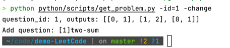
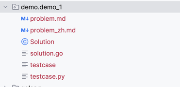
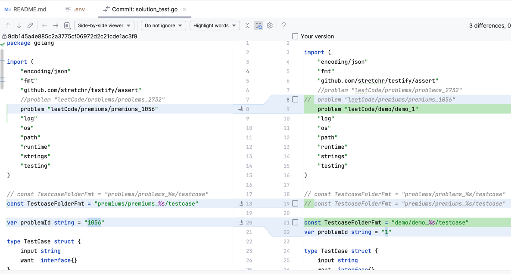

# LeetCode

Debugging LeetCode locally, Automatic daily problems generator, submit solutions directly and more!

**Algorithms in LeetCode by Benhao**

# Table of Content

- [How to start](#how-to-start)
- [Cookie Auto Updater](#cookie-auto-updater)
-  [Interview](interview.md)
    * [Templates](algorithm_templates/templates.md) 
- [Supported Languages](#supported-languages)
    * [Python3](#python3)
    * [Golang](#golang)
    * [Java](#java)
    * [Cpp](#cpp)
    * [TypeScript](#typescript)
    * [Rust](#Rust)
- [Demo](#Demo)
    * [Local](#Local)
    * [GitHub](#GitHub)
    * [Demo Projects](#Demo-Projects)
- [Problems](#problems)
    * [Easy](#easy)
    * [Medium](#medium)
    * [Hard](#hard)
    * [Mysql](#mysql)
    * [LCP](#lcp)
    * [Interview](#interview)
    * [剑指 Offer](#剑指-offer)

# How to start

After clone this repo, add a .env file to tell where to locate your problems and solutions (locally).
For remote GitHub Action, add `COOKIE` (LeetCode cookie), `PUSH_KEY` (PushDeer notification), `PROBLEM_FOLDER` (where to
add problems), `USER` (LeetCode personal page uri), `LOG_LEVEL` (Log print).

**Notice:** If you want more than just python3, add `LANGUAGES="python3,golang"` (and so on in .env)

Example .env file:

```text
PROBLEM_FOLDER="problems"
PUSH_KEY="***[key from PushDeer]"
COOKIE="***[cookie from LeetCode graphql]"
LANGUAGES="python3,golang,java,cpp,typescript,rust"
USER="himymben"
LOG_LEVEL="info"
PYTHONPATH=.
```

install python3.14 or higher requirements:

```shell
pip install -r python/requirements.txt
```

LeetCode tools all in one
```shell
python python/scripts/leetcode.py
```
usage demo:
```text
Setting up the environment...
Please select the configuration [0-1, default: 0]:
0. Load default config from .env
1. Custom config
1
Select multiple languages you want to use, separated by comma [0-5, default: 0]:
0. python3
1. java
2. golang
3. cpp
4. typescript
5. rust
0,2
Languages selected: python3, golang
--------------------------------------------------
Enter the problem folder path (press enter to use default): 
Problem folder selected: problems
--------------------------------------------------
Enter your LeetCode cookie (press enter to use default): 
--------------------------------------------------
Do you want to update the .env file with this configuration? [y/n, default: n]: 
--------------------------------------------------
Please select the main function [0-4, default: 0]:
0. Exit
1. Get problem
2. Submit
3. Clean empty java
4. Clean error rust
2
--------------------------------------------------
Please select the submit method [0-4, default: 0]:
0. Back
1. Daily submit[All selected languages]
2. Daily submit[Select language]
3. Submit specified problem[All selected languages]
4. Submit specified problem[Select language]
3
--------------------------------------------------
Enter the problem ID (e.g., 1, LCR 043, 面试题 01.01, etc.): 1
Starting submission, please wait...
Submitting in language: python3
Waiting for submit result:   1%|          | 1/100 [00:00<01:33,  1.06it/s]
INFO:root:[1.two-sum]提交结果
Accepted 63/63个通过的测试用例

执行用时: 3 ms 击败58.9912%
消耗内存: 18.6 MB 击败43.29040000000005%

代码:
class Solution:
    def twoSum(self, nums: List[int], target: int) -> List[int]:
        """
        :type nums: List[int]
        :type target: int
        :rtype: List[int]
        """
        mp = dict()
        for i, num in enumerate(nums):
            if (t := target - num) in mp:
                return [mp[t], i]
            mp[num] = i

INFO:root:提交详情: https://leetcode.cn/problems/two-sum/submissions/625296865/ [需登录查看]
INFO:root:题解查看: https://leetcode.cn/problems/two-sum/solutions/
INFO:root:外网查看: https://leetcode.com/problems/two-sum/solutions/
Submitting in language: golang
Waiting for submit result:   1%|          | 1/100 [00:00<01:30,  1.09it/s]
INFO:root:[1.two-sum]提交结果
Accepted 63/63个通过的测试用例

执行用时: 0 ms 击败100.0%
消耗内存: 5.7 MB 击败50.63709999999988%

代码:
func twoSum(nums []int, target int) []int {
	m := map[int]int{}
	for i, num := range nums {
		d := target - num
		if idx, ok := m[d]; ok {
			return []int{idx, i}
		}
		m[num] = i
	}
	return nil
}

INFO:root:提交详情: https://leetcode.cn/problems/two-sum/submissions/625296886/ [需登录查看]
INFO:root:题解查看: https://leetcode.cn/problems/two-sum/solutions/
INFO:root:外网查看: https://leetcode.com/problems/two-sum/solutions/
Submission completed.
--------------------------------------------------
Please select the submit method [0-4, default: 0]:
0. Back
1. Daily submit[All selected languages]
2. Daily submit[Select language]
3. Submit specified problem[All selected languages]
4. Submit specified problem[Select language]

Bye!
```

***DeprecationWarning: The tools below is deprecated, please use the new tools in python/scripts/leetcode.py***

To directly submit Solution to LeetCode, try any language below:

```shell
python python/scripts/submit.py -h
# usage: submit.py [-h] [-id ID] {go,py,ts,js,c++,java,golang,python3,typescript,javascript,cpp,rt,rust}
python python/scripts/submit.py python3 -id=1
python python/scripts/submit.py -id=2 py
python python/scripts/submit.py py
python python/scripts/submit.py golang -id=2
python python/scripts/submit.py cpp -id=1
python python/scripts/submit.py java -id=2
python python/scripts/submit.py typescript -id=1
python python/scripts/submit.py rust -id=1
```

To get any problem you want, try:

```shell
python python/scripts/get_problem.py -h
# usage: get_problem.py [-h] [-id PROBLEM_ID] [-slug PROBLEM_SLUG] [-cate PROBLEM_CATEGORY] [-f] [-all] [-pm] [-debug DEBUG_FILE] [-change] [-sl]
python python/scripts/get_problem.py -id=1
```

To generate daily problems, try:

```shell
python python/scripts/daily_auto.py
```

To fetch daily submits from LeetCode (requires `.env` COOKIE or USER to be ready), try:

```shell
python python/scripts/daily_submission.py
```

Some extra tools:

1. To backfield existing problems rating, try:

```shell
python python/scripts/tools.py rating
```

2. To get the lucky problem of the day, try:

```shell
python python/scripts/tools.py lucky 
```

**If you think there are too many logs for those scripts in the console, you can set the `LOG_LEVEL` in the `.env` file
to `ERROR`.**

# Cookie Auto Updater

Auto-update LeetCode CN Cookie from browser to GitHub Secrets or local .env file.

## Usage

```bash
# Update GitHub Secrets only
python python/scripts/leetcode_cookie_updater.py --repo QuBenhao/LeetCode

# Update local .env only
python python/scripts/leetcode_cookie_updater.py --env .env

# Update both
python python/scripts/leetcode_cookie_updater.py --repo QuBenhao/LeetCode --env .env

# Enable debug logging
python python/scripts/leetcode_cookie_updater.py --repo QuBenhao/LeetCode --log-level DEBUG

# Specify GitHub Token
python python/scripts/leetcode_cookie_updater.py --repo QuBenhao/LeetCode --github-token ghp_xxx
```

## Parameters

| Parameter | Description |
|-----------|-------------|
| `--repo REPO` | GitHub repo name (e.g., QuBenhao/LeetCode). Skip if not specified |
| `--env PATH` | Local .env file path. Skip if not specified |
| `--log-level LEVEL` | Log level: DEBUG, INFO, WARNING, ERROR (default: INFO) |
| `--github-token TOKEN` | GitHub Token (or set via GITHUB_TOKEN env var) |

## GitHub Token Permissions

To update GitHub Secrets, create a token with:
- `repo` (full repo access)
- `workflow` (update GitHub Actions)
- `secret` (update GitHub Repo Secret)

Steps:
1. Go to https://github.com/settings/tokens
2. Click "Generate new token (classic)"
3. Check `repo` and `workflow` and `secret` permissions
4. Generate and save the token

## Cron Job

Set up automatic Cookie updates via crontab:

```bash
# Run at 2 AM daily
0 2 * * * GITHUB_TOKEN="ghp_xxx" python /path/to/leetcode_cookie_updater.py --repo QuBenhao/LeetCode >> /tmp/leetcode_cookie.log 2>&1
```

## Supported Browsers

- Chrome
- Edge
- Firefox
- Chromium

# Supported Languages

## Python3

Check [Python3 README](python/README.md)

## Golang

Check [Golang README](golang/README.md)

## Java

Check [Java README](qubhjava/README.md)

## Cpp

Check [Cpp README](cpp/README.md)

## Typescript

Check [TypeScript README](typescript/README.md)

## Rust

Check [Rust README](rust/README.md)

# Demo

Fork the repo of your own


Clone your own forked repo

**Notice: create your own branch and set it as repo default, and keep master!**

## Local

Open the code project and installed languages environments as needed.

Test your environment by running languages test, for instance:

if you are facing errors here, contact the author.

Find a cookie from LeetCode (monthly update)


Create your own .env file (Notice: better to use a problem folder other than exists as the author is using them, there
will be a lot of conflicts):

```
PROBLEM_FOLDER=demo
COOKIE="***[cookie from LeetCode graphql]"
LANGUAGES="golang,java"
```

Create the folder 'demo' based on your own .env

Run scripts to fetch problems, run tests and submit your solution.

If you get problem like this,

it will add the problem and change the tests of your languages as below:



In VsCode,
add launch.json under `.vscode`

```json5
{
  // Use IntelliSense to learn about possible attributes.
  // Hover to view descriptions of existing attributes.
  // For more information, visit: https://go.microsoft.com/fwlink/?linkid=830387
  "version": "0.2.0",
  "configurations": [
    {
      "name": "Typescript Test",
      "type": "node",
      "request": "launch",
      "preLaunchTask": "typescript-test",
    },
    {
      "name": "Typescript Tests",
      "type": "node",
      "request": "launch",
      "preLaunchTask": "typescript-tests",
    },
    {
      "name": "Python Test",
      "type": "node",
      "request": "launch",
      "preLaunchTask": "python-test",
    },
    {
      "name": "Python Tests",
      "type": "node",
      "request": "launch",
      "preLaunchTask": "python-tests",
    },
    {
      "name": "Golang Test",
      "type": "node",
      "request": "launch",
      "preLaunchTask": "golang-test",
    },
    {
      "name": "Golang Tests",
      "type": "node",
      "request": "launch",
      "preLaunchTask": "golang-tests",
    },
    {
      "name": "C++ Test",
      "type": "node",
      "request": "launch",
      "preLaunchTask": "cpp-test",
    },
    {
      "name": "C++ Tests",
      "type": "node",
      "request": "launch",
      "preLaunchTask": "cpp-tests",
    },
    {
      "name": "Java Test",
      "type": "node",
      "request": "launch",
      "preLaunchTask": "java-test",
    },
    {
      "name": "Java Tests",
      "type": "node",
      "request": "launch",
      "preLaunchTask": "java-tests",
    },
    {
      "name": "Rust Test",
      "type": "node",
      "request": "launch",
      "preLaunchTask": "rust-test",
    },
    {
      "name": "Rust Tests",
      "type": "node",
      "request": "launch",
      "preLaunchTask": "rust-tests",
    }
  ]
}
```

and tasks.json under `.vscode`

```json5
{
  "version": "2.0.0",
  "tasks": [
    {
      "label": "typescript-test",
      "command": "npm",
      "args": [
        "test",
        "--alwaysStric",
        "--strictBindCallApply",
        "--strictFunctionTypes",
        "--target",
        "ES2022",
        "typescript/test.ts"
      ],
      "type": "shell"
    },
    {
      "label": "typescript-tests",
      "command": "npm",
      "args": [
        "test",
        "--alwaysStric",
        "--strictBindCallApply",
        "--strictFunctionTypes",
        "--target",
        "ES2022",
        "typescript/problems.test.ts"
      ],
      "type": "shell"
    },
    {
      "label": "python-test",
      "command": "python",
      "args": [
        "python/test.py"
      ],
      "type": "shell"
    },
    {
      "label": "python-tests",
      "command": "python",
      "args": [
        "python/tests.py"
      ],
      "type": "shell"
    },
    {
      "label": "golang-test",
      "command": "go",
      "args": [
        "test",
        "golang/solution_test.go",
        "golang/test_basic.go",
        "-test.timeout",
        "3s"
      ],
      "type": "shell"
    },
    {
      "label": "golang-tests",
      "command": "go",
      "args": [
        "test",
        "golang/problems_test.go",
        "golang/test_basic.go",
        "-test.timeout",
        "10s"
      ],
      "type": "shell"
    },
    {
      "label": "cpp-test",
      "type": "shell",
      "command": "sh",
      "args": [
        "-c",
        "bazel fetch --force daily && bazel test --cxxopt=-std=c++23 --cxxopt=-O2 --cxxopt=-fsanitize=address --cxxopt=-D_GLIBCXX_USE_CXX11_ABI=1 --linkopt=-fsanitize=address --test_timeout=3 --test_output=all //:daily_test"
      ]
    },
    {
      "label": "cpp-tests",
      "type": "shell",
      "command": "sh",
      "args": [
        "-c",
        "bazel fetch --force daily && bazel test --cxxopt=-std=c++23 --cxxopt=-O2 --cxxopt=-fsanitize=address --cxxopt=-D_GLIBCXX_USE_CXX11_ABI=1 --linkopt=-fsanitize=address --test_timeout=10 --test_output=all $(bazel query \"filter(\\\"plan_*\\\", kind(cc_test, //...))\")"
      ]
    },
    {
      "label": "java-test",
      "command": "mvn",
      "args": [
        "test",
        "-Dtest=\"qubhjava.test.TestMain\""
      ],
      "type": "shell"
    },
    {
      "label": "java-tests",
      "command": "mvn",
      "args": [
        "test",
        "-Dtest=\"qubhjava.test.ProblemsTest\""
      ],
      "type": "shell"
    },
    {
      "label": "rust-test",
      "command": "cargo",
      "args": [
        "test",
        "--test",
        "solution_test"
      ],
      "type": "shell"
    },
    {
      "label": "rust-tests",
      "command": "cargo",
      "args": [
        "test",
        "--test",
        "solutions_test"
      ],
      "type": "shell"
    }
  ]
}
```

If you want to write c++ in idea better, load this `.bazelproject`.

```yaml
directories:
  cpp
  problems
  premiums
derive_targets_from_directories: false
targets:
  //cpp:solution_test
  //:all
```

Solve your problem and enjoy!

Feel free to ask the author and add issues, discussions on GitHub.

## GitHub

Config [GitHub Action Secrets](https://docs.github.com/en/authentication/keeping-your-account-and-data-secure/managing-your-personal-access-tokens#creating-a-personal-access-token-classic)
for daily auto scripts. {SECRETS: TOKEN}


Add values similar to you .env, for example,


**Notice:**
Add PROBLEM_FOLDER for [actions](.github/workflows/) to work properly.

### Enable GitHub Actions Below based on your needs:
1. [Daily Problems](.github/workflows/daily.yml)
2. [Submits Check](.github/workflows/daily_check.yml)
3. [Sync](.github/workflows/sync.yml)

**Notice:**
Do not enable [Semantic Release](.github/workflows/release.yml) unless you know what you are doing.

## Demo Projects

1. [Benhao Demo](https://github.com/BenhaoQu/LeetCode/tree/demo_master) (Python3)
2. [SilentSliver Demo](https://github.com/SilentSliver/LeetCode/) (Java)
3. [LazyKindMan Demo](https://github.com/lazyKindMan/LeetCode) (Golang)
