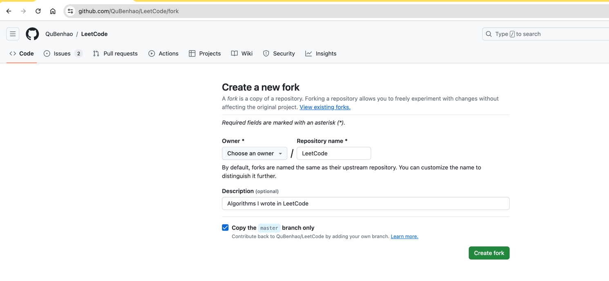
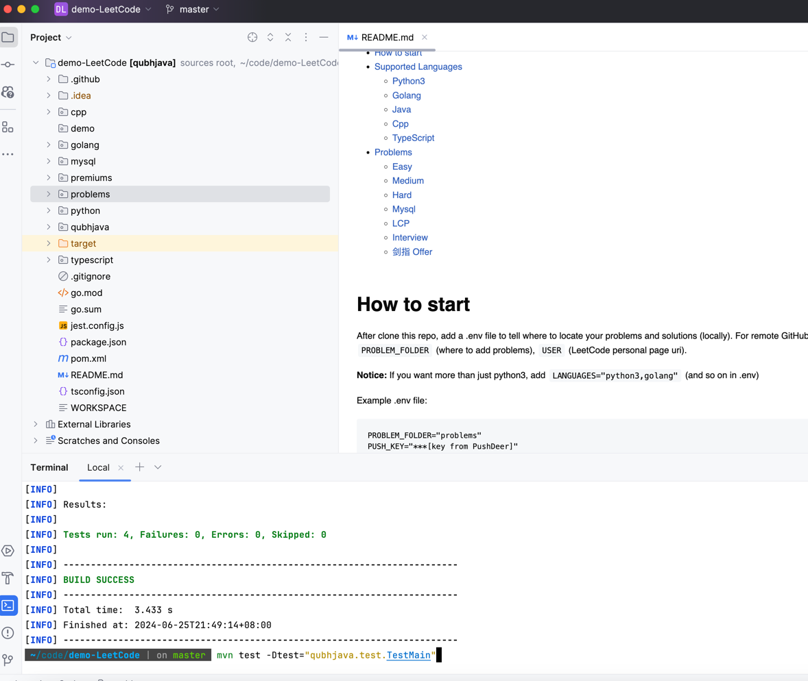
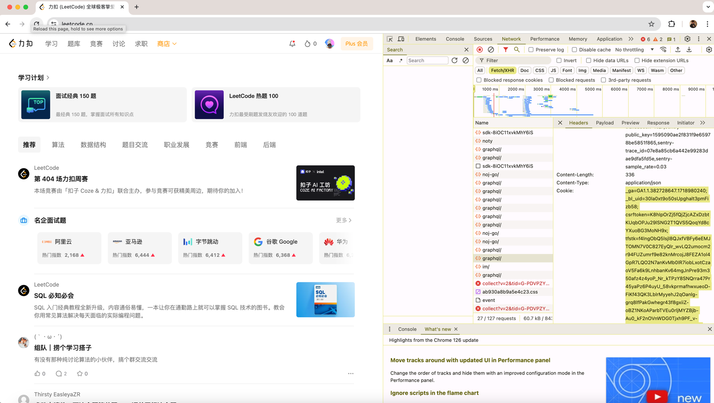
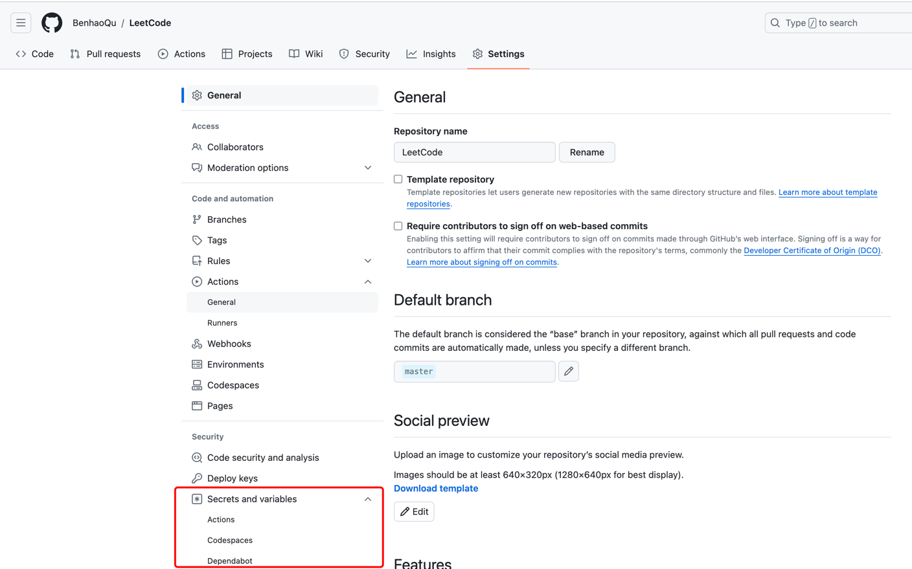
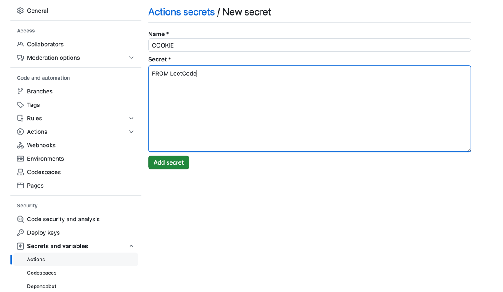

# LeetCode

本地调试 LeetCode、自动生成每日题目、直接提交解决方案等更多功能！

**Benhao 的 LeetCode 算法题解**

# 目录

- [快速开始](#快速开始)
- [Cookie 自动更新工具](#cookie-自动更新工具)
- [Interview](interview.md)
    * [模板](algorithm_templates/templates.md) 
- [支持的语言](#支持的语言)
    * [Python3](#python3)
    * [Golang](#golang)
    * [Java](#java)
    * [Cpp](#cpp)
    * [TypeScript](#typescript)
    * [Rust](#rust)
- [演示](#演示)
    * [本地](#本地)
    * [GitHub](#github)
    * [演示项目](#演示项目)
- [题目列表](#题目列表)
    * [简单](#简单)
    * [中等](#中等)
    * [困难](#困难)
    * [Mysql](#mysql)
    * [LCP](#lcp)
    * [面试题](#面试题)
    * [剑指 Offer](#剑指-offer)

# 快速开始

克隆仓库后，添加 .env 文件来指定题目和解决方案的位置（本地）。
对于远程 GitHub Action，需要添加 `COOKIE`（LeetCode cookie）、`PUSH_KEY`（PushDeer 通知）、`PROBLEM_FOLDER`（题目存放位置）、`LEETCODE_USER`（LeetCode 个人主页 uri）、`LOG_LEVEL`（日志级别）。

**注意：** 如果需要使用 python3 以外的语言，在 .env 中添加 `LANGUAGES="python3,golang"` 等

.env 文件示例：

```text
PROBLEM_FOLDER="problems"
PUSH_KEY="***[PushDeer 的 key]"
COOKIE="***[LeetCode graphql 的 cookie]"
LANGUAGES="python3,golang,java,cpp,typescript,rust"
LEETCODE_USER="himymben"
LOG_LEVEL="info"
PYTHONPATH=.
```

### 自动链接相似题目

当两道题目解法相同但数据范围不同时（例如 `n <= 100` vs `n <= 10^5`），可以启用自动链接功能避免重复代码：

```text
AUTO_LINK_SIMILAR="true"  # 设置为 "true" 启用（默认关闭）
```

启用后，系统会通过比较以下内容检测相似题目：
- 题目描述（归一化处理）
- 方法签名（方法名、参数、返回类型）
- 标题相似度

如果发现相似题目，只创建 `link.json` 而不创建解答文件：

```json
{
  "link_to": "3740",
  "link_folder": "problems",
  "reason": "Auto-detected: description matches, method_name matches, signature matches, different constraints"
}
```

对于 GitHub Actions，在仓库设置中添加 `AUTO_LINK_SIMILAR` secret 并设为 `true`。

安装 python3.14 或更高版本的要求：

```shell
pip install -r python/requirements.txt
```

LeetCode 工具集：

```shell
python python/scripts/leetcode.py
```

使用示例：
```text
Setting up the environment...
Please select the configuration [0-1, default: 0]:
0. Load default config from .env
1. Custom config
1
Select multiple languages you want to use, separated by comma [0-5, default: 0]:
0. python3
1. java
2. golang
3. cpp
4. typescript
5. rust
0,2
Languages selected: python3, golang
```

# Cookie 自动更新工具

自动从浏览器获取 LeetCode CN Cookie，支持更新 GitHub Secrets 或本地 .env 文件。

## 使用方法

```bash
# 只更新 GitHub Secrets
python python/scripts/leetcode_cookie_updater.py --repo QuBenhao/LeetCode

# 只更新本地 .env
python python/scripts/leetcode_cookie_updater.py --env .env

# 同时更新
python python/scripts/leetcode_cookie_updater.py --repo QuBenhao/LeetCode --env .env

# 开启 debug 日志
python python/scripts/leetcode_cookie_updater.py --repo QuBenhao/LeetCode --log-level DEBUG

# 指定 GitHub Token
python python/scripts/leetcode_cookie_updater.py --repo QuBenhao/LeetCode --github-token ghp_xxx
```

## 参数说明

| 参数 | 说明 |
|------|------|
| `--repo REPO` | GitHub 仓库名 (如 QuBenhao/LeetCode)，不指定则不更新 GitHub |
| `--env PATH` | 本地 .env 文件路径，不指定则不更新本地文件 |
| `--log-level LEVEL` | 日志级别: DEBUG, INFO, WARNING, ERROR (默认: INFO) |
| `--github-token TOKEN` | GitHub Token (也可通过环境变量 GITHUB_TOKEN 设置) |

## GitHub Token 权限

如果要更新 GitHub Secrets，需要创建具有以下权限的 Token：
- `repo` (完整仓库访问)
- `workflow` (更新 GitHub Actions)
- `secret` (更新GitHub仓库的Secret)

创建步骤：
1. 访问 https://github.com/settings/tokens
2. 点击 "Generate new token (classic)"
3. 勾选 `repo` 和 `workflow` 和 `secret` 权限
4. 生成并保存 Token

## 定时任务

可以通过 crontab 设置定时任务自动更新 Cookie：

```bash
# 每天凌晨 2 点更新
0 2 * * * GITHUB_TOKEN="ghp_xxx" python /path/to/leetcode_cookie_updater.py --repo QuBenhao/LeetCode >> /tmp/leetcode_cookie.log 2>&1
```

## 支持的浏览器

- Chrome
- Edge
- Firefox
- Chromium

# 支持的语言

## Python3

查看 [Python3 README](python/README.md)

## Golang

查看 [Golang README](golang/README.md)

## Java

查看 [Java README](qubhjava/README.md)

## Cpp

查看 [Cpp README](cpp/README.md)

## Typescript

查看 [TypeScript README](typescript/README.md)

## Rust

查看 [Rust README](rust/README.md)

# 演示

Fork 你自己的仓库：


克隆你 fork 的仓库

**注意：创建你自己的分支并设为默认分支，保留 master 分支！**

## 本地

打开代码项目并安装所需的语言环境。

运行语言测试来验证环境，例如：

如果遇到错误，请联系作者。

从 LeetCode 获取 cookie（每月更新）：


创建你自己的 .env 文件（注意：最好使用与作者不同的题目文件夹，会有很多冲突）：

```
PROBLEM_FOLDER=demo
COOKIE="***[LeetCode graphql 的 cookie]"
LANGUAGES="golang,java"
```

根据你的 .env 创建 'demo' 文件夹

运行脚本获取题目、运行测试并提交你的解决方案。

## GitHub

配置 [GitHub Action Secrets](https://docs.github.com/en/authentication/keeping-your-account-and-data-secure/managing-your-personal-access-tokens#creating-a-personal-access-token-classic)
用于每日自动脚本。{SECRETS: TOKEN}


添加与 .env 类似的值，例如：


**注意：**
为 [actions](.github/workflows/) 添加 PROBLEM_FOLDER 才能正常工作。

### 根据需要启用以下 GitHub Actions：
1. [Daily Problems](.github/workflows/daily.yml)
2. [Submits Check](.github/workflows/daily_check.yml)
3. [Sync](.github/workflows/sync.yml)

**注意：**
除非你知道自己在做什么，否则不要启用 [Semantic Release](.github/workflows/release.yml)。

## 演示项目

1. [Benhao Demo](https://github.com/BenhaoQu/LeetCode/tree/demo_master) (Python3)
2. [SilentSliver Demo](https://github.com/SilentSliver/LeetCode/) (Java)
3. [LazyKindMan Demo](https://github.com/lazyKindMan/LeetCode) (Golang)
