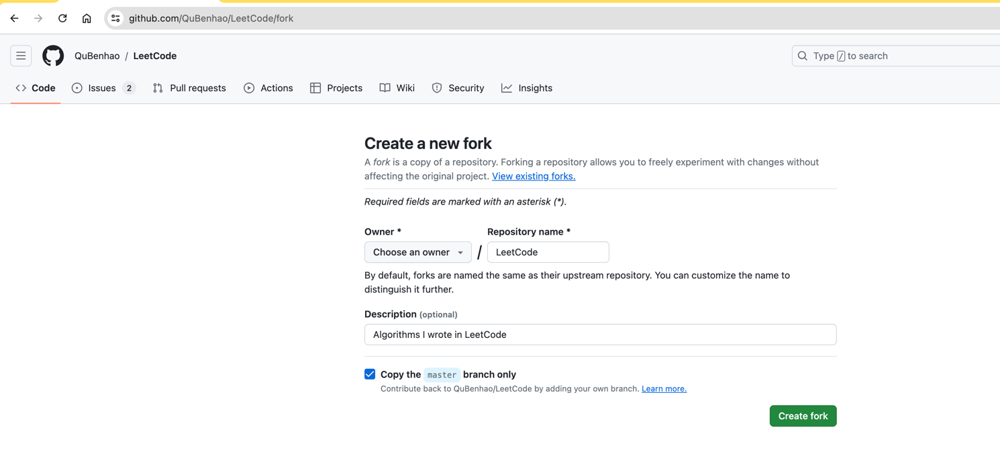
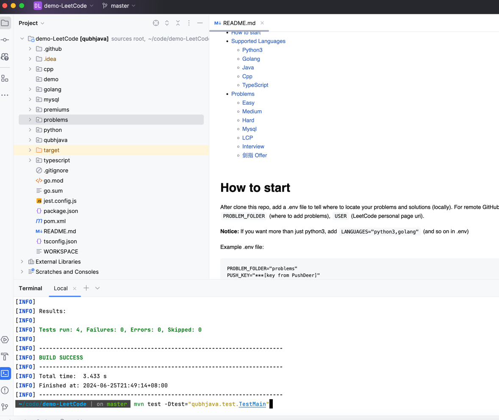
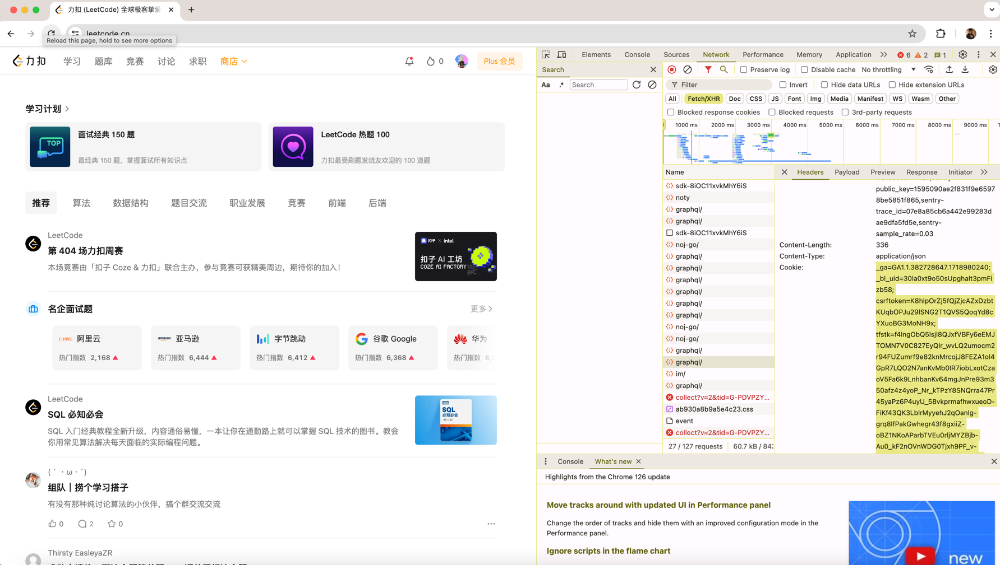
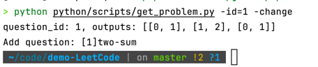
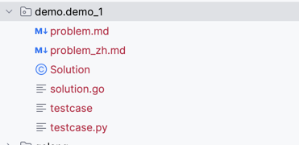
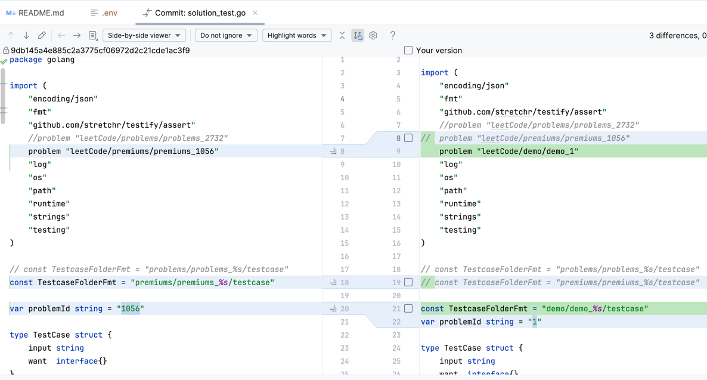
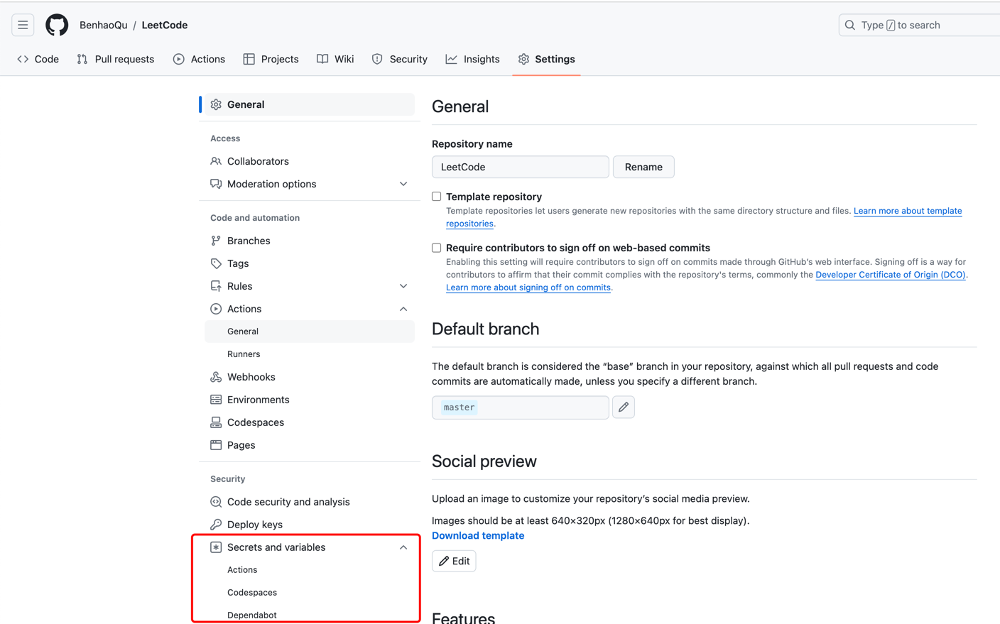
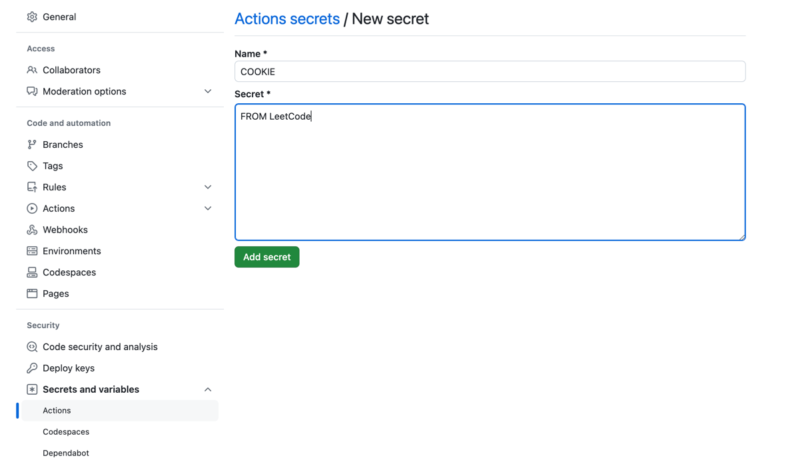

# LeetCode

Debug LeetCode locally, generate daily problems automatically, submit solutions directly, and more!

**Benhao's LeetCode algorithm solutions**

# Contents

- [Quick start](#quick-start)
- [Automatic Cookie update tool](#automatic-cookie-update-tool)
- [Interview](interview.md)
    * [Templates](algorithm_templates/templates.md) 
- [Supported languages](#supported-languages)
    * [Python3](#python3)
    * [Golang](#golang)
    * [Java](#java)
    * [Cpp](#cpp)
    * [TypeScript](#typescript)
    * [Rust](#rust)
- [Demo](#demo)
    * [Local](#local)
    * [GitHub](#github)
    * [Demo projects](#demo-projects)
- [Problems](#problems)
    * [Easy](#easy)
    * [Medium](#medium)
    * [Hard](#hard)
    * [Mysql](#mysql)
    * [LCP](#lcp)
    * [Interview problems](#interview-problems)
    * [剑指 Offer](#剑指-offer)

# Quick start

After cloning the repository, add a .env file to specify the local problem and solution locations.
For remote GitHub Actions, add `COOKIE` (LeetCode cookie), `PUSH_KEY` (PushDeer notifications), `PROBLEM_FOLDER` (problem location), `LEETCODE_USER` (LeetCode profile URI), and `LOG_LEVEL` (logging level).

**Note:** To use languages other than python3, add a setting such as `LANGUAGES="python3,golang"` to .env.

Example .env file:

```text
PROBLEM_FOLDER="problems"
PUSH_KEY="***[PushDeer 的 key]"
COOKIE="***[LeetCode graphql 的 cookie]"
LANGUAGES="python3,golang,java,cpp,typescript,rust"
LEETCODE_USER="himymben"
LOG_LEVEL="info"
PYTHONPATH=.
```

### Automatically link similar problems

When two problems share a solution but have different constraints (such as `n <= 100` versus `n <= 10^5`), enable automatic linking to avoid duplicate code:

```text
AUTO_LINK_SIMILAR="true"  # Set to "true" to enable (disabled by default)
```

When enabled, the tool detects similar problems by comparing:
- Normalized problem descriptions
- Method signatures (method name, parameters, and return type)
- Title similarity

If a similar problem is found, the tool creates only `link.json`, without solution files:

```json
{
  "link_to": "3740",
  "link_folder": "problems",
  "reason": "Auto-detected: description matches, method_name matches, signature matches, different constraints"
}
```

For GitHub Actions, add an `AUTO_LINK_SIMILAR` secret in the repository settings and set it to `true`.

Install the requirements for python3.14 or later:

```shell
pip install -r python/requirements.txt
```

LeetCode toolkit:

```shell
python python/scripts/leetcode.py
```

Usage example:
```text
Setting up the environment...
Please select the configuration [0-1, default: 0]:
0. Load default config from .env
1. Custom config
1
Select multiple languages you want to use, separated by comma [0-5, default: 0]:
0. python3
1. java
2. golang
3. cpp
4. typescript
5. rust
0,2
Languages selected: python3, golang
```

# Automatic Cookie update tool

Fetch LeetCode CN Cookies automatically from browsers and update GitHub Secrets or the local .env file.

## Usage

```bash
# Update only GitHub Secrets
python python/scripts/leetcode_cookie_updater.py --repo QuBenhao/LeetCode

# Update only the local .env file
python python/scripts/leetcode_cookie_updater.py --env .env

# Update both
python python/scripts/leetcode_cookie_updater.py --repo QuBenhao/LeetCode --env .env

# Enable debug logging
python python/scripts/leetcode_cookie_updater.py --repo QuBenhao/LeetCode --log-level DEBUG

# Specify a GitHub Token
python python/scripts/leetcode_cookie_updater.py --repo QuBenhao/LeetCode --github-token ghp_xxx
```

## Options

| Option | Description |
|------|------|
| `--repo REPO` | GitHub repository name (such as QuBenhao/LeetCode); omit to skip GitHub updates |
| `--env PATH` | Local .env file path; omit to skip local updates |
| `--log-level LEVEL` | Logging level: DEBUG, INFO, WARNING, ERROR (default: INFO) |
| `--github-token TOKEN` | GitHub Token (also configurable through the GITHUB_TOKEN environment variable) |

## GitHub Token permissions

To update GitHub Secrets, create a Token with these permissions:
- `repo` (full repository access)
- `workflow` (update GitHub Actions)
- `secret` (update repository Secrets)

Creation steps:
1. Visit https://github.com/settings/tokens
2. Click "Generate new token (classic)"
3. Select the `repo`, `workflow`, and `secret` permissions
4. Generate and save the Token

## Scheduled tasks

Use crontab to schedule automatic Cookie updates:

```bash
# Update daily at 2 a.m.
0 2 * * * GITHUB_TOKEN="ghp_xxx" python /path/to/leetcode_cookie_updater.py --repo QuBenhao/LeetCode >> /tmp/leetcode_cookie.log 2>&1
```

## Supported browsers

- Chrome
- Edge
- Firefox
- Chromium

# Supported languages

## Python3

See the [Python3 README](python/README.md)

## Golang

See the [Golang README](golang/README.md)

## Java

See the [Java README](qubhjava/README.md)

## Cpp

See the [Cpp README](cpp/README.md)

## Typescript

See the [TypeScript README](typescript/README.md)

## Rust

See the [Rust README](rust/README.md)

# Demo

Fork the repository:


Clone your fork

**Note: Create your own branch and make it the default, while keeping the master branch!**

## Local

Open the project and install the required language environments.

Run the language tests to check the environment, for example:

Contact the author if you encounter errors.

Get the LeetCode cookie (refresh it monthly):


Create your own .env file (use a different problem folder from the author's to avoid frequent conflicts):

```
PROBLEM_FOLDER=demo
COOKIE="***[LeetCode graphql 的 cookie]"
LANGUAGES="golang,java"
```

Create the 'demo' folder according to your .env file

Run the script to fetch problems, run tests, and submit your solutions.

For a problem such as the following,

the tool adds the problem and updates the test files for your chosen languages:



In VS Code,
add launch.json under `.vscode`

```json5
{
  // 使用 IntelliSense 了解相关属性。
  // 悬停以查看现有属性的描述。
  // 欲了解更多信息，请访问: https://go.microsoft.com/fwlink/?linkid=830387
  "version": "0.2.0",
  "configurations": [
    {
      "name": "Typescript Test",
      "type": "node",
      "request": "launch",
      "preLaunchTask": "typescript-test",
    },
    {
      "name": "Typescript Tests",
      "type": "node",
      "request": "launch",
      "preLaunchTask": "typescript-tests",
    },
    {
      "name": "Python Test",
      "type": "node",
      "request": "launch",
      "preLaunchTask": "python-test",
    },
    {
      "name": "Python Tests",
      "type": "node",
      "request": "launch",
      "preLaunchTask": "python-tests",
    },
    {
      "name": "Golang Test",
      "type": "node",
      "request": "launch",
      "preLaunchTask": "golang-test",
    },
    {
      "name": "Golang Tests",
      "type": "node",
      "request": "launch",
      "preLaunchTask": "golang-tests",
    },
    {
      "name": "C++ Test",
      "type": "node",
      "request": "launch",
      "preLaunchTask": "cpp-test",
    },
    {
      "name": "C++ Tests",
      "type": "node",
      "request": "launch",
      "preLaunchTask": "cpp-tests",
    },
    {
      "name": "Java Test",
      "type": "node",
      "request": "launch",
      "preLaunchTask": "java-test",
    },
    {
      "name": "Java Tests",
      "type": "node",
      "request": "launch",
      "preLaunchTask": "java-tests",
    },
    {
      "name": "Rust Test",
      "type": "node",
      "request": "launch",
      "preLaunchTask": "rust-test",
    },
    {
      "name": "Rust Tests",
      "type": "node",
      "request": "launch",
      "preLaunchTask": "rust-tests",
    }
  ]
}
```

Add tasks.json under `.vscode`

```json5
{
  "version": "2.0.0",
  "tasks": [
    {
      "label": "typescript-test",
      "command": "npm",
      "args": [
        "test",
        "--alwaysStric",
        "--strictBindCallApply",
        "--strictFunctionTypes",
        "--target",
        "ES2022",
        "typescript/test.ts"
      ],
      "type": "shell"
    },
    {
      "label": "typescript-tests",
      "command": "npm",
      "args": [
        "test",
        "--alwaysStric",
        "--strictBindCallApply",
        "--strictFunctionTypes",
        "--target",
        "ES2022",
        "typescript/problems.test.ts"
      ],
      "type": "shell"
    },
    {
      "label": "python-test",
      "command": "python",
      "args": [
        "python/test.py"
      ],
      "type": "shell"
    },
    {
      "label": "python-tests",
      "command": "python",
      "args": [
        "python/tests.py"
      ],
      "type": "shell"
    },
    {
      "label": "golang-test",
      "command": "go",
      "args": [
        "test",
        "-tags=goexperiment.jsonv2",
        "golang/solution_test.go",
        "golang/test_basic.go",
        "-test.timeout",
        "3s",
        "-v"
      ],
      "type": "shell"
    },
    {
      "label": "golang-tests",
      "command": "go",
      "args": [
        "test",
        "-tags=goexperiment.jsonv2",
        "golang/problems_test.go",
        "golang/test_basic.go",
        "-test.timeout",
        "10s",
        "-v"
      ],
      "type": "shell"
    },
    {
      "label": "cpp-test",
      "type": "shell",
      "command": "sh",
      "args": [
        "-c",
        "bazel fetch --force daily && bazel test --cxxopt=-std=c++23 --cxxopt=-O2 --cxxopt=-fsanitize=address --linkopt=-fsanitize=address --test_timeout=3 --test_output=all //:daily_test"
      ]
    },
    {
      "label": "cpp-tests",
      "type": "shell",
      "command": "sh",
      "args": [
        "-c",
        "bazel fetch --force daily && bazel test --cxxopt=-std=c++23 --cxxopt=-O2 --cxxopt=-fsanitize=address --linkopt=-fsanitize=address --test_timeout=10 --test_output=all $(bazel query \"filter(\\\"plan_*\\\", kind(cc_test, //...))\")"
      ]
    },
    {
      "label": "java-test",
      "command": "mvn",
      "args": [
        "test",
        "-Dtest=\"qubhjava.test.TestMain\""
      ],
      "type": "shell"
    },
    {
      "label": "java-tests",
      "command": "mvn",
      "args": [
        "test",
        "-Dtest=\"qubhjava.test.ProblemsTest\""
      ],
      "type": "shell"
    },
    {
      "label": "rust-test",
      "command": "cargo",
      "args": [
        "test",
        "--test",
        "solution_test"
      ],
      "type": "shell"
    },
    {
      "label": "rust-tests",
      "command": "cargo",
      "args": [
        "test",
        "--test",
        "solutions_test"
      ],
      "type": "shell"
    }
  ]
}
```

## GitHub

Configure [GitHub Action Secrets](https://docs.github.com/en/authentication/keeping-your-account-and-data-secure/managing-your-personal-access-tokens#creating-a-personal-access-token-classic)
for the automatic daily script. {SECRETS: TOKEN}


Add values similar to those in .env, for example:


**Note:**
Add PROBLEM_FOLDER for [actions](.github/workflows/) to work correctly.

### Enable these GitHub Actions as needed:
1. [Daily Problems](.github/workflows/daily.yml)
2. [Submits Check](.github/workflows/daily_check.yml)
3. [Sync](.github/workflows/sync.yml)

**Note:**
Do not enable [Semantic Release](.github/workflows/release.yml) unless you know what you are doing.

## Demo projects

1. [Benhao Demo](https://github.com/BenhaoQu/LeetCode/tree/demo_master) (Python3)
2. [SilentSliver Demo](https://github.com/SilentSliver/LeetCode/) (Java)
3. [LazyKindMan Demo](https://github.com/lazyKindMan/LeetCode) (Golang)
